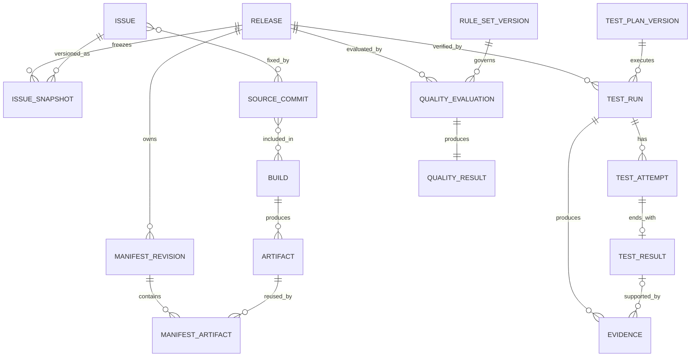

# 01 — Domain Model

## 1. Goal and V0.1 Mapping

This design maps the V0.1 Core Contract to implementable aggregates, value objects, and cross-module references without introducing replacement concepts. Release remains the delivery unit, Manifest remains authoritative, Evidence remains first-class, and deterministic Rules still produce Quality Results.

## 2. Module Boundaries

| Module | Responsible For | Not Responsible For | Primary Input | Primary Output |
|---|---|---|---|---|
| Release | Release identity, state, authoritative Manifest reference | Test execution, external Issue parsing | Create command, Manifest Lock result | Release, lifecycle events |
| Manifest | Revision, schema/semantic/checksum validation, Lock | Automatically following APK/Jira/Branch changes | Manifest document, Artifact metadata | Locked Manifest, content digest |
| Issue | Normalized Issue, Release Issue Snapshot | Exposing Jira-private fields to Core | Adapter data | Versioned Issue Snapshot |
| Traceability | Strongly typed relationships, verification status, Confidence | Treating guessed missing relationships as facts | Issue/Commit/Build/Artifact/Release | Traceability Snapshot |
| Test Management | Plan, Case, Device, Agent, Run, Attempt, Result | Final Release Quality decision | Locked Release, Test definitions, Agent state | Test Result, Evidence collection request |
| Evidence | Metadata, upload session, checksum, Payload reference | Quality threshold decisions | Agent upload, Collector output | Verifiable Evidence |
| Quality | Rule Set, input snapshot, Rule Result, Quality Result | Collecting data, calling Jira, human inference | Frozen facts and Rules | PASS/WARNING/BLOCK |
| Identity & Audit | User/service/device identity, RBAC, append-only Audit | Storing plaintext Secrets | OIDC Claims, operation context | Authorization decision, Audit Event |
| Adapter | External authentication, pagination, rate limits, mapping, cursor, retry | Becoming the authoritative Core model | Jira/internal system/CI API | Normalized DTO and synchronization report |

Modules communicate only through application use-case interfaces or versioned events. A module must not bypass interfaces to modify another module's tables directly.

## 3. Core Entities

| V0.1 Entity | V0.2 Implementation Refinement | Identity | Lifecycle Owner |
|---|---|---|---|
| Release | Release + state history | `releaseId` | Release |
| Release Manifest | Manifest Revision + Lock | `manifestId`, `revision` | Manifest |
| Artifact | Artifact + Digest | `artifactId` | Manifest/Traceability |
| Issue | Normalized Issue + Snapshot | `source`, `sourceIssueId`, `snapshotVersion` | Issue |
| Commit | Source Commit | `repository`, `commitId` | Traceability |
| Build | Build Record | `buildId` + provider | Traceability |
| Test Plan | Test Plan Version | `planId`, `version` | Test Management |
| Test Case | Test Case Version | `caseId`, `version` | Test Management |
| Test Run | Run + Attempt | `testRunId` | Test Management |
| Test Result | Terminal result of each Case Attempt | `testResultId` | Test Management |
| Evidence | Metadata + external Payload | `evidenceId` | Evidence |
| Traceability | Four strongly typed Edge types + Snapshot | `edgeId`, `snapshotId` | Traceability |
| Quality Rule | Rule + Rule Set Version | `ruleId`, `version` | Quality |
| Quality Result | Evaluation + Rule Results | `qualityResultId` | Quality |

Device, Agent, Environment Snapshot, Attempt, Upload Session, and Audit Event are implementation-support entities. They do not replace or change the Core Contract.

## 4. Aggregates and Invariants

### 4.1 Release Aggregate

- `releaseId` is immutable after creation and independent of Jira Version, Git Branch, Build Number, and APK Version.
- `READY_FOR_TEST` and later states reference exactly one Locked Manifest.
- Manifest cannot be replaced after testing starts; content changes create a new Release.
- `COMPLETED` is a workflow archival state and does not mean PASS.

### 4.2 Manifest Aggregate

- Draft content may be replaced before Lock, but every registration creates an immutable revision.
- Lock atomically records the normalized document digest, Artifact associations, actor, and time.
- Locked content, digest, and Artifact set are immutable.

### 4.3 Test Run Aggregate

- A Test Run is bound to one Release, Locked Manifest digest, Test Plan Version, and Environment Snapshot.
- Each execution or retry creates a new Attempt; historical Attempts are never overwritten.
- Test Result is the terminal Attempt state: PASS, FAIL, BLOCKED, ERROR, SKIPPED, or TIMEOUT.

### 4.4 Evidence Aggregate

- After Metadata creation, only upload state may transition. After completion, Payload URI, size, and checksum are immutable.
- Evidence references at least Release and Test Run, and may reference Test Result, Device, and Artifact.
- Evidence with failed Payload validation must not enter Quality inputs.

### 4.5 Quality Aggregate

- Evaluation fixes references to the input snapshot digest and a published Rule Set Version.
- Rule Result and final Quality Result are append-only and never overwritten by in-place re-evaluation.
- Identical normalized inputs and Rule Set must produce identical Rule outputs.

## 5. Relationships and Cardinality



Issue↔Commit and Commit↔Build are implemented through named Edge entities that carry proof source, verification status, and Confidence. The many-to-many relationships in the diagram show only business cardinality.

## 6. Lifecycle Overview

```text
Release: DRAFT → REGISTERED → READY_FOR_TEST → TESTING
         → QUALITY_EVALUATED → COMPLETED

Quality Result: PASS | WARNING | BLOCK

Manifest: DRAFT → VALIDATED → REGISTERED → LOCKED
Test Run: CREATED → WAITING_FOR_AGENT → RUNNING → COMPLETED|ERROR|TIMEOUT|CANCELLED
Evidence: PENDING_UPLOAD → UPLOADING → AVAILABLE | REJECTED | EXPIRED
Rule Set: DRAFT → VALIDATED → PUBLISHED → RETIRED
```

An illegal transition returns an explicit conflict and is never silently corrected. State history includes actor, time, reason, and related command ID.

## 7. Version Strategy

- Domain/API/Agent Protocol use compatibility versions.
- Manifest, Test Plan, Test Case, Rule, and Rule Set use content versions and immutable published versions.
- Issue, Traceability, and Quality Input use Snapshot versions.
- Evidence stores Metadata Schema Version and Collector Version.
- Historical interpretation depends on original versions; migration must not rewrite historical business meaning.

## 8. MVP and Deferred Scope

MVP: one project/platform, one real test bench, two Issue Adapter types, one CI entry, Crash/ANR/basic Memory, a restricted Rule model, and fixed RBAC.

Deferred: organization hierarchy, multi-tenancy, dynamic authorization language, large device pools, cross-Release analytics, AI recommendations, and general graph queries.

## 9. Acceptance Criteria and Evidence

1. Every V0.1 Core Entity maps to a persistent model and API and is neither merged nor removed.
2. External APK/Jira/Branch/Build changes do not alter an existing Release.
3. Fixed, Included, and Verified can be queried separately and each has Evidence.
4. Test Agent cannot write Quality Result.
5. Repeated evaluation with the same input snapshot and Rule version produces the same result.

Acceptance evidence: domain glossary, ER diagram, state-transition contract tests, module dependency tests, and an end-to-end traceability report.
