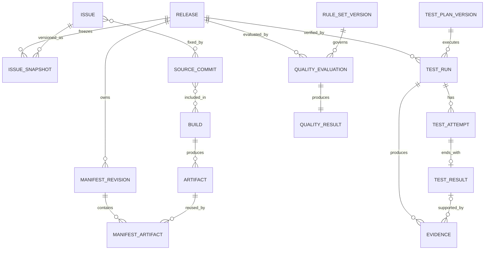

# 01 — Domain Model

## 1. 目标与 V0.1 映射

本设计把 V0.1 Core Contract 映射为可实现的聚合、值对象和跨模块引用，不新增替代概念。Release 仍是交付单位，Manifest 仍是权威定义，Evidence 仍是一级实体，质量结果仍由确定性规则产生。

## 2. 模块边界

| 模块 | 负责 | 不负责 | 主要输入 | 主要输出 |
|---|---|---|---|---|
| Release | Release 身份、状态、权威 Manifest 引用 | 测试执行、外部 Issue 解析 | 创建命令、Manifest Lock 结果 | Release、生命周期事件 |
| Manifest | Revision、Schema/语义/校验和校验、Lock | 自动跟随 APK/Jira/Branch 变化 | Manifest 文档、Artifact 元数据 | Locked Manifest、内容摘要 |
| Issue | Normalized Issue、Release Issue Snapshot | 暴露 Jira 私有字段给 Core | Adapter 数据 | 版本化 Issue Snapshot |
| Traceability | 强类型关系、验证状态、Confidence | 猜测缺失关系为事实 | Issue/Commit/Build/Artifact/Release | Traceability Snapshot |
| Test Management | Plan、Case、Device、Agent、Run、Attempt、Result | 最终 Release 质量决定 | Locked Release、测试定义、Agent 状态 | Test Result、Evidence 采集请求 |
| Evidence | Metadata、上传会话、Checksum、Payload 引用 | 质量阈值判断 | Agent 上传、Collector 输出 | 可验证 Evidence |
| Quality | Rule Set、输入快照、Rule Result、Quality Result | 采集数据、调用 Jira、人工推测 | 冻结事实与规则 | PASS/WARNING/BLOCK |
| Identity & Audit | 用户/服务/设备身份、RBAC、追加审计 | 保存 Secret 明文 | OIDC Claims、操作上下文 | 授权决定、Audit Event |
| Adapter | 外部认证、分页、限流、映射、游标、重试 | 成为 Core 权威模型 | Jira/内部系统/CI API | 标准化 DTO 与同步报告 |

模块间只通过应用用例接口或版本化事件通信；禁止一个模块绕过接口直接修改另一模块的表。

## 3. 核心实体

| V0.1 实体 | V0.2 实施细化 | 身份 | 生命周期所有者 |
|---|---|---|---|
| Release | Release + 状态历史 | `releaseId` | Release |
| Release Manifest | Manifest Revision + Lock | `manifestId`, `revision` | Manifest |
| Artifact | Artifact + Digest | `artifactId` | Manifest/Traceability |
| Issue | Normalized Issue + Snapshot | `source`, `sourceIssueId`, `snapshotVersion` | Issue |
| Commit | Source Commit | `repository`, `commitId` | Traceability |
| Build | Build Record | `buildId` + provider | Traceability |
| Test Plan | Test Plan Version | `planId`, `version` | Test Management |
| Test Case | Test Case Version | `caseId`, `version` | Test Management |
| Test Run | Run + Attempt | `testRunId` | Test Management |
| Test Result | 每个 Case Attempt 的终态结果 | `testResultId` | Test Management |
| Evidence | Metadata + 外部 Payload | `evidenceId` | Evidence |
| Traceability | 四类强类型 Edge + Snapshot | `edgeId`, `snapshotId` | Traceability |
| Quality Rule | Rule + Rule Set Version | `ruleId`, `version` | Quality |
| Quality Result | Evaluation + Rule Results | `qualityResultId` | Quality |

Device、Agent、Environment Snapshot、Attempt、Upload Session、Audit Event 是实施支撑实体，不替换或改变 Core Contract。

## 4. 聚合与不变量

### 4.1 Release Aggregate

- `releaseId` 创建后不可变，独立于 Jira Version、Git Branch、Build Number 和 APK Version。
- `READY_FOR_TEST` 及之后必须引用一个且仅一个 Locked Manifest。
- 开始测试后不得更换 Manifest；内容变化创建新 Release。
- `COMPLETED` 是流程封存状态，不等价于 PASS。

### 4.2 Manifest Aggregate

- Revision 在 Lock 前可替换草稿内容，但每次注册形成不可变 revision。
- Lock 原子地保存规范化文档摘要、Artifact 关联和锁定人/时间。
- 已 Lock 的内容、摘要和 Artifact 集合不可修改。

### 4.3 Test Run Aggregate

- Test Run 固定绑定 Release、Locked Manifest 摘要、Test Plan Version 和 Environment Snapshot。
- 每次执行或重试创建新的 Attempt；历史 Attempt 不覆盖。
- Test Result 是 Attempt 终态，状态为 PASS、FAIL、BLOCKED、ERROR、SKIPPED 或 TIMEOUT。

### 4.4 Evidence Aggregate

- Metadata 创建后只有上传状态可转换；完成后 Payload URI、大小和 checksum 不可修改。
- Evidence 至少关联 Release 与 Test Run，可选关联 Test Result、Device 和 Artifact。
- Payload 校验失败的 Evidence 不得进入 Quality 输入。

### 4.5 Quality Aggregate

- Evaluation 固定引用输入快照摘要和已发布 Rule Set Version。
- Rule Result 与最终 Quality Result 追加写入，不原地重算覆盖。
- 同一规范化输入与 Rule Set 必须得到相同规则输出。

## 5. 关系与基数



Issue↔Commit 和 Commit↔Build 实际通过具名 Edge 实体表达，以携带证明来源、验证状态和 Confidence；图中多对多仅表示业务基数。

## 6. 生命周期总览

```text
Release: DRAFT → REGISTERED → READY_FOR_TEST → TESTING
         → QUALITY_EVALUATED → COMPLETED

Quality Result: PASS | WARNING | BLOCK

Manifest: DRAFT → VALIDATED → REGISTERED → LOCKED
Test Run: CREATED → WAITING_FOR_AGENT → RUNNING → COMPLETED|ERROR|TIMEOUT|CANCELLED
Evidence: PENDING_UPLOAD → UPLOADING → AVAILABLE | REJECTED | EXPIRED
Rule Set: DRAFT → VALIDATED → PUBLISHED → RETIRED
```

非法转换返回显式冲突，不做静默纠正。状态历史包含操作者、时间、原因和关联命令 ID。

## 7. 版本策略

- Domain/API/Agent Protocol 使用兼容性版本。
- Manifest、Test Plan、Test Case、Rule、Rule Set 使用内容版本和不可变发布版本。
- Issue、Traceability、Quality Input 使用 Snapshot 版本。
- Evidence 保存 Metadata Schema Version 与 Collector Version。
- 历史解释依赖原版本；迁移不得重写历史业务含义。

## 8. MVP 与延期

MVP：单项目/平台、一个真实测试台架、两类 Issue Adapter、一类 CI 入口、Crash/ANR/基础 Memory、受限规则模型和固定 RBAC。

延期：组织树、多租户、动态权限语言、大规模设备池、跨 Release 分析、AI 建议、通用图查询。

## 9. 验收标准与证据

1. 每个 V0.1 Core Entity 都能映射到持久化模型和 API，不被合并或删除。
2. APK/Jira/Branch/Build 外部变化不会改变已创建 Release。
3. Fixed、Included、Verified 可分别查询并有证据。
4. Test Agent 无法写入 Quality Result。
5. 同一输入快照与规则版本重复评估结果一致。

验收证据：领域词汇表、ER 图、状态转换契约测试、模块依赖测试、端到端追溯报告。
