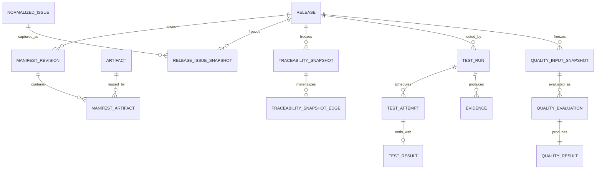
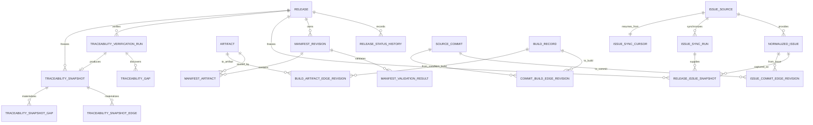
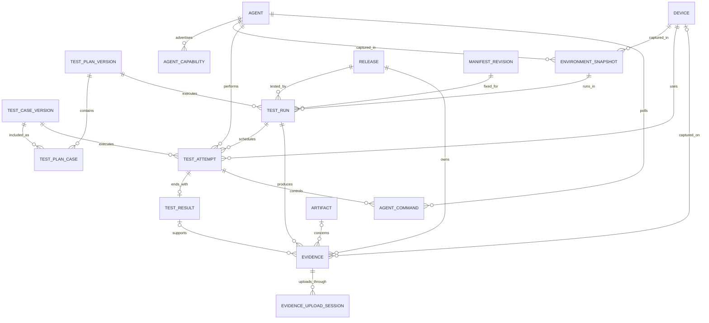
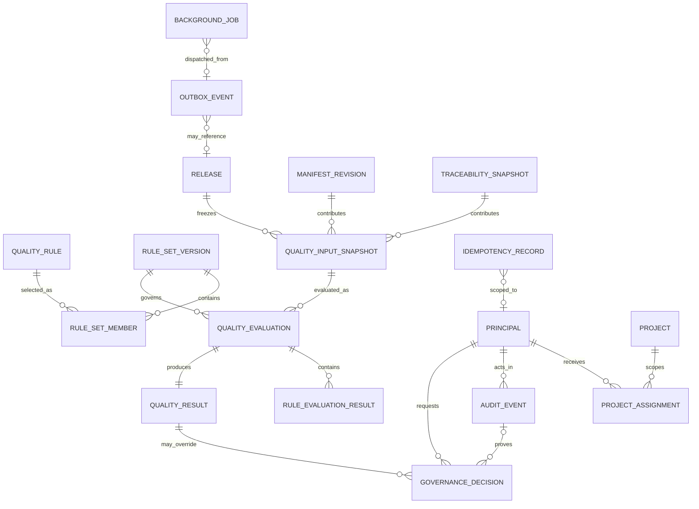

# 02 — Database Architecture and ER Model

## 1. 决策摘要

结构化数据使用单一 PostgreSQL 实例；Evidence Payload 使用 S3 兼容对象存储。原因和替代方案见 [TDR-003](tdr/TDR-003-postgresql.md) 与 [TDR-004](tdr/TDR-004-s3-compatible-evidence-storage.md)。

模块化单体使用一个数据库和同一事务管理器，但表按领域前缀分组。MVP 使用单 schema，避免过早增加迁移与权限复杂度。每张表只有一个领域模块负责写入；数据库不是绕过模块接口的集成总线。

三个权威性决定：

1. Build→Artifact 只由版本化 Traceability Edge 表达，`artifact` 不保存 `build_id`。
2. Artifact→Release 只由 Release 的 Locked Manifest 派生，不建立可独立写入的关系表。
3. 历史 Traceability Snapshot 物化完整 Edge Fact；后续验证只能产生新 Edge Revision 和新 Snapshot。

## 2. 通用约定

- 主键：`uuid`，由应用生成 UUIDv7；对外业务标识另设唯一键。
- 时间：`timestamptz` UTC；所有实体有 `created_at`。仅允许变化的当前状态记录有 `updated_at` 和乐观锁 `row_version`。
- 枚举：MVP 使用受 CHECK 约束的 `varchar`，避免 PostgreSQL enum 的迁移摩擦。
- JSONB：只保存版本化原始快照、规则文档和扩展 Metadata；身份、关系、状态和常用筛选字段必须结构化列化。
- 外部版本：`source_version` 使用非空 `varchar(255)`，视为 Source 内的不透明标识；禁止解析为整数或跨 Source 排序。
- 删除：Release 历史、Snapshot、Result、Audit 和已发布定义不物理删除。临时会话与运行遥测只能按明确保留策略清理。
- 数值：必须携带规范单位；时间长度统一为毫秒。
- FK：所有 FK 列建立索引；用于 Composite FK 的被引用列必须有对应 UNIQUE。
- 不可变记录：通过最小数据库权限和拒绝 UPDATE/DELETE 的 Trigger 双重保护；修订使用 INSERT，不覆盖旧行。

## 3. ER 视图说明

不存在一张能兼顾可读性与全部列细节的“单一总图”。以下先给 Core ER Overview，再按领域给出完整持久化关系。图中的每个实体都必须出现在第 8 节 Table Catalog；视图 `artifact_release_edge_v` 不是可写实体。

### 3.1 Core ER Overview



### 3.2 Release、Issue 与 Traceability ER



### 3.3 Test、Agent 与 Evidence ER



### 3.4 Quality、Identity、Audit 与 Operations ER



## 4. Release、Manifest 与 Artifact

| 表 | PK | 关键 FK | UNIQUE / CHECK | 生命周期 |
|---|---|---|---|---|
| `release` | `id` | `locked_manifest_id → manifest_revision.id`（延迟绑定） | `release_id`；状态 CHECK | 永久保留 |
| `release_status_history` | `id` | `release_id → release.id`, `actor_id → principal.id` | `(release_id, sequence_no)` | Append-only |
| `manifest_revision` | `id` | `release_id → release.id` | `(release_id, revision)`, `content_digest` | REGISTERED 后不可变 |
| `manifest_validation_result` | `id` | `manifest_revision_id → manifest_revision.id` | `(manifest_revision_id, validator_version)` | Append-only |
| `artifact` | `id` | 无 Build FK | `artifact_id`, `(checksum_algorithm, checksum_value)` | 内容寻址、可复用 |
| `manifest_artifact` | `(manifest_revision_id, artifact_id)` | 两侧 FK | `(manifest_revision_id, ordinal)`；`required NOT NULL` | 随 Revision 不可变 |

`release.locked_manifest_id` 初始为空。Lock 事务先校验 Manifest 属于该 Release，再写入 LOCKED 状态、Release 引用、状态历史、Audit 和 Outbox。部分唯一索引保证一个 Release 至多一个 LOCKED Manifest。Artifact 不包含 `build_id`；Build provenance 只能通过 `build_artifact_edge_revision` 查询。

Artifact→Release 的权威关系定义为只读视图：

```sql
CREATE VIEW artifact_release_edge_v AS
SELECT r.id AS release_id,
       mr.id AS manifest_revision_id,
       mr.revision AS manifest_revision,
       mr.content_digest AS manifest_digest,
       ma.artifact_id,
       ma.required,
       ma.ordinal
FROM release r
JOIN manifest_revision mr ON mr.id = r.locked_manifest_id
JOIN manifest_artifact ma ON ma.manifest_revision_id = mr.id
WHERE mr.state = 'LOCKED';
```

该视图只返回 LOCKED Manifest 的成员，并携带 Manifest Revision ID、Manifest digest、`required` 与 ordinal。它不得提供 INSERT/UPDATE/DELETE，也不得被缓存为另一份可写关系。

## 5. Issue 与外部版本

| 表 | PK | 关键 FK | UNIQUE / CHECK | 生命周期 |
|---|---|---|---|---|
| `issue_source` | `id` | credential reference 不是 Secret | `source_key` | 可禁用，不删除历史 |
| `normalized_issue` | `id` | `source_id → issue_source.id` | `(source_id, source_issue_id, source_version)` | 每个外部版本 Append-only |
| `issue_sync_run` | `id` | `source_id → issue_source.id` | `sync_run_id` | 永久保留摘要 |
| `issue_sync_cursor` | `source_id` | `source_id → issue_source.id` | 一 Source 一 Cursor | 可更新当前游标 |
| `release_issue_snapshot` | `id` | `release_id`, `issue_id`, `sync_run_id` | `(release_id, snapshot_version, issue_id)` | Append-only |

`normalized_issue.source_version` 是 Source 内的不透明字符串，可保存 ETag、更新时间戳、Revision Token 或数值的无损字符串形式。相等性只在同一 `issue_source` 内比较；排序使用 `observed_at` 与本地序列，不解释 `source_version`。

## 6. Traceability Edge Revision 与 Snapshot

### 6.1 Persisted Edge

持久化三类外部 provenance Edge：`issue_commit_edge_revision`、`commit_build_edge_revision`、`build_artifact_edge_revision`。每行都是不可变 Revision，共同列如下：

- `id`：本 Revision 的 UUIDv7 PK。
- `edge_id`：逻辑 Edge 的稳定 UUID。
- `revision`：从 1 开始的整数；UNIQUE `(edge_id, revision)`。
- 两端强类型 FK；同一 `edge_id` 的端点永远不变。
- `source_type`、`source_reference`、`evidence_id`。
- `confidence`、`verification_status`、`verified_at`、`verified_by`、`reason`。
- `validator_version`、`previous_revision_id`、`previous_revision`、`content_digest`、`created_at`。

新同步命中相同事实且 content digest 未变时返回已有 Revision；验证状态、Confidence 或证明变化时 INSERT `revision + 1`，不得 UPDATE。每张表增加 UNIQUE `(id, edge_id, revision)`，并用 Composite FK `(previous_revision_id, edge_id, previous_revision) → (id, edge_id, revision)` 指向同一逻辑 Edge 的上一行；行内 CHECK 要求 Revision 1 的 previous 字段全为空，其余行满足 `previous_revision = revision - 1`。Deferred Constraint Trigger 另外拒绝同一 `edge_id` 改变端点或 source identity。数据库角色拒绝对 Edge Revision 执行 UPDATE/DELETE。

Artifact→Release 不创建 Revision 表。Snapshot 创建事务从 `artifact_release_edge_v` 读取并生成 MANIFEST 来源的物化 Edge Fact，因此 Locked Manifest 仍是唯一权威来源。该 Fact 的 `source_edge_id` 由 Manifest Revision ID 与 Artifact ID 确定性生成，`source_edge_revision` 使用 Manifest revision；它们仅用于历史身份与 digest，不形成可写关系。

### 6.2 Materialized Snapshot

`traceability_snapshot` 保存 `release_id`、`version`、`verification_run_id`、`schema_version`、`policy_version`、`content_digest` 和 `created_at`，UNIQUE `(release_id, version)` 与 `content_digest`。

`traceability_snapshot_edge` 不只保存 Edge ID，而是完整保存：

- `snapshot_id`, `ordinal` 作为复合 PK；
- `edge_type`, `from_entity_type`, `from_entity_id`, `to_entity_type`, `to_entity_id`；
- `source_edge_id`, `source_edge_revision`, `source_type`, `source_reference`；
- `confidence`, `verification_status`, `verified_at`, `validator_version`, `reason`；
- `evidence_id`, `fact_digest`。

`traceability_snapshot_gap` 同样物化 expected edge、Issue/Release、reason、diagnostic code 和 gap digest。Snapshot、Snapshot Edge 和 Snapshot Gap 在创建事务提交后禁止 UPDATE/DELETE。Snapshot digest 按稳定 ordinal 对所有 Edge Fact/Gaps 的 digest 计算；重放禁止回查 Edge 的最新 Revision。

## 7. PostgreSQL 可执行一致性约束

### 7.1 Evidence 与 Test 的 Composite FK

PostgreSQL CHECK 不跨行查询，因此不使用 CHECK 声称 Test Result 属于同一 Run。采用以下结构性约束：

```text
test_run:
  UNIQUE (id, release_id)

test_attempt:
  FK (test_run_id) → test_run(id)
  UNIQUE (id, test_run_id)

test_result:
  test_run_id NOT NULL
  FK (attempt_id, test_run_id) → test_attempt(id, test_run_id)
  UNIQUE (id, test_run_id)
  UNIQUE (attempt_id)

evidence:
  release_id NOT NULL
  test_run_id NOT NULL
  test_result_id NULL
  FK (test_run_id, release_id) → test_run(id, release_id)
  FK (test_result_id, test_run_id) → test_result(id, test_run_id)
```

因此跨 Release 的 Run 或跨 Run 的 Result 无法写入 Evidence。`test_result_id IS NULL` 表示 Run-level Evidence；非空时 Composite FK 必须匹配。Evidence 的可选 `artifact_id` 由应用事务校验属于该 Release 的 Locked Manifest，并把 Manifest digest 写入 Evidence Metadata；这不是第二个 Artifact→Release 来源。

### 7.2 其他强约束

1. Release 进入 `READY_FOR_TEST` 前必须存在 `locked_manifest_id`。
2. Locked Manifest 必须属于同一 Release，且 Artifact 集合非空。
3. V0.2 Artifact checksum 仅允许 SHA-256，并校验字符格式。
4. Test Run 使用 `(release_id, manifest_revision_id)` 与 Locked Manifest digest；创建后不可变。
5. Attempt number 从 1 递增；终态不可回到运行态。
6. AVAILABLE Evidence 必须具备 object key、size、checksum 和 Collector Version。
7. Quality Evaluation 只引用 COMPLETE Quality Input Snapshot 与 PUBLISHED Rule Set。
8. `ERROR`、缺失或不一致输入不得通过默认值变为 PASS。
9. Manual Edge 和 Governance Decision 必须有 actor、reason 与 Audit Event。

跨聚合状态判断由应用事务执行；能够用 FK、UNIQUE、NOT NULL 或行内 CHECK 表达的不变量必须由数据库同时执行。不得使用宽泛异常捕获隐藏约束失败。

## 8. Complete Table Catalog

### 8.1 Test、Agent 与 Evidence

| 表 | PK | 关键 FK | UNIQUE / Cardinality | 删除与保留 |
|---|---|---|---|---|
| `test_plan_version` | `id` | 无 | `(plan_id, version)`；1:N Revision | PUBLISHED 后不可变 |
| `test_case_version` | `id` | 无 | `(case_id, version)`；1:N Revision | PUBLISHED 后不可变 |
| `test_plan_case` | `(plan_version_id, case_version_id)` | Plan、Case | `(plan_version_id, ordinal)`；M:N | 随 Plan 保留 |
| `device` | `id` | 无 | `device_id`；Device 1:N Snapshot/Attempt | 撤销，不删历史 |
| `agent` | `id` | `principal_id` | `agent_id`；Agent 1:N Capability/Command | REVOKED，不删历史 |
| `agent_capability` | `id` | `agent_id` | `(agent_id, capability, version)` | 旧能力保留 |
| `environment_snapshot` | `id` | `device_id`, `agent_id` | `content_digest`；1:N Run | Append-only |
| `test_run` | `id` | Release、Manifest、Plan、Environment | `test_run_id`, `(id, release_id)` | 不物理删除 |
| `test_attempt` | `id` | Run、Case、Agent、Device | `(test_run_id, case_version_id, attempt_no)`, `(id, test_run_id)` | Append-only 状态历史 |
| `test_result` | `id` | `(attempt_id, test_run_id)` | `attempt_id`, `(id, test_run_id)`；Attempt 0..1 Result | Append-only |
| `agent_command` | `id` | Agent、Attempt | `command_id`, `idempotency_key`；Attempt 1:N | Payload 按策略归档 |
| `evidence` | `id` | `(test_run_id, release_id)`, `(test_result_id, test_run_id)`, Device、Artifact | `evidence_id`；Run 1:N | Metadata 不删 |
| `evidence_upload_session` | `id` | `evidence_id` | `object_key`；Evidence 1:N Session | 到期清理，摘要保留 |

### 8.2 Quality、Identity、Governance 与 Operations

| 表 | PK | 关键 FK | UNIQUE / Cardinality | 删除与保留 |
|---|---|---|---|---|
| `quality_rule` | `id` | author/reviewer Principal | `(rule_id, version)`, `content_digest` | PUBLISHED 后不可变 |
| `rule_set_version` | `id` | publisher Principal | `(rule_set_id, version)`, `content_digest` | PUBLISHED 后不可变 |
| `rule_set_member` | `(rule_set_version_id, rule_id, rule_version)` | Rule Set、Rule | Rule Set 1:N Member | 随 Rule Set 保留 |
| `quality_input_snapshot` | `id` | Release、Manifest、Issue/Trace Snapshot | `input_digest`；Release 1:N | Append-only |
| `quality_evaluation` | `id` | Input Snapshot、Rule Set | `evaluation_id`, 幂等复合键 | Append-only |
| `rule_evaluation_result` | `id` | Evaluation、Rule | `(evaluation_id, rule_id, rule_version)` | Append-only |
| `quality_result` | `id` | `evaluation_id` | `evaluation_id`, `result_digest`；Evaluation 1:1 | Append-only |
| `principal` | `id` | 无 | `(issuer, subject)` | 禁用，不删历史 |
| `project` | `id` | 无 | `project_key` | 归档，不删除历史引用 |
| `project_assignment` | `(principal_id, project_id, role)` | Principal、Project | 同 PK；M:N | 撤销有审计 |
| `audit_event` | `id` | actor Principal 可空 | `event_id`, `(request_id, sequence_no)` | Append-only，正式归档 |
| `governance_decision` | `id` | Quality Result、requester、approver、Audit | `decision_id`；Result 1:N | Append-only，不覆盖算法结果 |
| `idempotency_record` | `id` | Principal 可空 | `(scope, principal_id, idempotency_key)` | 超过重试窗口后清理 |
| `outbox_event` | `id` | 可选 Release | `event_id`；Domain Transaction 1:N | 发布后按周期归档 |
| `background_job` | `id` | 可选 Outbox Event | `(job_type, idempotency_key)` | 完成摘要保留，Dead Letter 不自动删 |

### 8.3 Release、Issue 与 Traceability 补充实体

| 表 | PK | 关键 FK | UNIQUE / Cardinality | 删除与保留 |
|---|---|---|---|---|
| `source_commit` | `id` | repository reference | `(repository, commit_id)`；Commit 1:N Edge Revision | 不物理删除 |
| `build_record` | `id` | provider reference | `(provider, build_id)`；Build 1:N Edge Revision | 不物理删除 |
| `issue_commit_edge_revision` | `id` | Issue、Commit、previous Revision、Evidence 可空 | `(edge_id, revision)`；逻辑 Edge 1:N Revision | Append-only |
| `commit_build_edge_revision` | `id` | Commit、Build、previous Revision、Evidence 可空 | `(edge_id, revision)`；逻辑 Edge 1:N Revision | Append-only |
| `build_artifact_edge_revision` | `id` | Build、Artifact、previous Revision、Evidence 可空 | `(edge_id, revision)`；逻辑 Edge 1:N Revision | Append-only |
| `traceability_verification_run` | `id` | Release、policy version | `verification_run_id`；Release 1:N | Append-only |
| `traceability_gap` | `id` | Verification Run、Release、Issue 可空 | `(verification_run_id, gap_digest)` | Append-only |
| `traceability_snapshot` | `id` | Release、Verification Run | `(release_id, version)`, `content_digest` | Append-only |
| `traceability_snapshot_edge` | `(snapshot_id, ordinal)` | Snapshot、Evidence 可空 | `(snapshot_id, fact_digest)` | Append-only |
| `traceability_snapshot_gap` | `(snapshot_id, ordinal)` | Snapshot | `(snapshot_id, gap_digest)` | Append-only |

第 4～6 节列出的其余表同样属于 Complete Table Catalog。任何新增持久化实体必须在 Migration Review 时补充本节 PK、FK、Cardinality 与 Retention；仅在代码中新增 ORM Entity 不可接受。

## 9. 事务边界

- Create Release：Release + 首条状态历史 + Audit + Outbox 同事务。
- Register Manifest：Revision + Artifact links + Validation Result 同事务。
- Lock Manifest：完整性复检 + Lock + Release 引用 + 状态历史 + Audit + Outbox 同事务。
- Verify Traceability：Verification Run + 新 Edge Revisions + Gaps 同事务分批提交；完成后以单事务创建不可变 Snapshot。
- Create Test Run：Run + Locked Manifest identity + Environment Snapshot reference + Audit + Outbox 同事务。
- Complete Test Result：Attempt 终态 + Result + Outbox 同事务；Evidence 上传独立完成。
- Complete Evidence：对象 metadata 校验后，Evidence 状态 + Audit + Outbox 同事务。
- Publish Rule Set：规则验证 + Version 发布 + Audit 同事务。
- Complete Evaluation：Input Snapshot + Rule Results + Quality Result + Release 状态历史同事务。

对象存储不能参与数据库事务，使用上传状态机、checksum 和 reconciliation 实现可恢复一致性，不宣称分布式原子事务。

## 10. 索引、生命周期与迁移

MVP 必需索引：Release `(project, created_at DESC)`；Snapshot `(release_id, version DESC)`；Edge `(edge_id, revision DESC)`、两端 FK、`(verification_status, confidence)`；Run/Attempt `(release_id, created_at DESC)`、`(agent_id, state, lease_expires_at)`；Evidence `(release_id, type, captured_at)`、`(test_run_id, upload_state)`；Quality `(release_id, created_at DESC)`；Audit `(resource_type, resource_id, occurred_at)`。

Release/Manifest/Traceability/Quality、Issue Snapshot、Test Result、Evidence Metadata 与 Audit 在审计期内不物理删除。Evidence Payload 按项目保留策略分层或删除，必须满足无 legal hold、存在 Audit Event、Metadata 保留且历史 Result 能解释。Upload Session、Heartbeat、已完成 Job 与 Idempotency Record 可按明确周期清理。

Flyway Migration 只前进，使用 `V<sequence>__<meaning>.sql`。采用 Expand → Migrate → Contract；已应用脚本不可修改，破坏性 Contract 至少跨一个兼容发布。每次发布在上一版本备份副本演练 Migration 和恢复，部署记录关联应用、Schema 与 Git commit。

## 11. Constraint Integration Test

必须在真实 PostgreSQL 上验证，而非 H2 或 Mock：

1. 同一 Release 并发 Lock 只有一个成功且无部分写入。
2. `artifact` Schema 不存在 `build_id`；Build→Artifact 只能由 Edge Revision 查询。
3. 非 Locked Manifest Artifact 不出现在 `artifact_release_edge_v`。
4. 更新 Edge 状态会 INSERT 新 Revision；旧 Revision、旧 Snapshot Edge 与 digest 不变。
5. 跨 Release 的 `(test_run_id, release_id)` Evidence 插入被 Composite FK 拒绝。
6. 跨 Run 的 `(test_result_id, test_run_id)` Evidence 插入被 Composite FK 拒绝。
7. ETag 和非数值 Revision Token 可无损保存为 `source_version`。
8. 对 Snapshot、Edge Revision、Quality Result 和 Audit 的 UPDATE/DELETE 被权限或 Trigger 拒绝。
9. 重复 Adapter/Agent/API 请求不产生重复实体。
10. 任意 Quality Result 可查询到固定 Manifest、Issue/Trace Snapshot、Test Result、Evidence 和 Rule Set。

验收证据：Schema 导出、Migration Test、Constraint Integration Test、并发测试、Snapshot Replay digest、Explain Plan 样本、备份恢复记录和数据一致性巡检报告。

## 12. 故障与恢复

- 数据库不可用：写入失败并显式返回；不得内存暂存后宣称成功。
- 事务冲突：基于乐观锁返回 409；调用方读取最新状态后决定是否重试。
- Migration 失败：停止部署并恢复旧应用；不可逆变更按演练从备份恢复。
- 主库损坏：从备份 + WAL/PITR 恢复，再对 Evidence Object inventory 与 Metadata 做 reconciliation。
- 数据不一致：隔离受影响 Release，拒绝 Quality Evaluation，输出可审计诊断。
