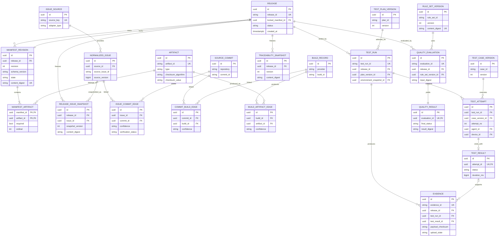

# 02 — Database Architecture and ER Model

## 1. Decision Summary

Use a single PostgreSQL instance for structured data and S3-compatible object storage for Evidence Payloads. See [TDR-003](tdr/TDR-003-postgresql.md) and [TDR-004](tdr/TDR-004-s3-compatible-evidence-storage.md) for rationale and alternatives.

The modular monolith uses one database and transaction manager, while tables are grouped by domain prefix or PostgreSQL schema. MVP recommends one schema with clear table-name prefixes to avoid migration and permission complexity. The database does not become an integration bus that bypasses domain boundaries.

## 2. General Conventions

- Primary key: `uuid`, generated by the application as UUIDv7; externally visible business identifiers have separate unique keys.
- Time: `timestamptz` in UTC. Every entity has `created_at`; mutable records also have `updated_at` and optimistic-lock `row_version`.
- Enums: MVP uses CHECK-constrained `varchar` to avoid PostgreSQL enum migration friction.
- JSONB: stores only versioned raw snapshots, Rule documents, and extension Metadata. Critical query fields must be structured columns.
- Deletion: historical core data is not physically deleted; status and retention policy are used. Credential references may be revoked and temporary upload sessions may be removed.
- Numeric metrics other than money use explicit unit columns; durations use milliseconds.
- Every FK column is indexed; common Release-scoped queries use composite indexes.

## 3. Complete ER Diagram

## 4. Table Design and Keys

### 4.1 Release / Manifest / Artifact

| Table | PK | Key FK | Unique Constraint | Lifecycle |
|---|---|---|---|---|
| `release` | `id` | `locked_manifest_id → manifest_revision.id` (deferred binding) | `release_id` | Retained permanently, state recorded append-only |
| `release_status_history` | `id` | `release_id → release.id`, `actor_id` | `(release_id, sequence_no)` | Append-only |
| `manifest_revision` | `id` | `release_id → release.id` | `(release_id, revision)`, `content_digest` | Immutable after REGISTERED |
| `artifact` | `id` | optional `build_id → build_record.id` | `(checksum_algorithm, checksum_value)`; `artifact_id` | Content-addressed and reusable across Releases |
| `manifest_artifact` | composite `(manifest_id, artifact_id)` | FK on both sides | `(manifest_id, ordinal)` | Locked with Manifest |

To break the Release/Manifest creation-order cycle, `release.locked_manifest_id` is initially null. In one transaction, Lock validates that the Manifest belongs to the Release, changes Manifest state, and writes the reference and state history. A partial unique index ensures at most one `LOCKED` Manifest per Release.

### 4.2 Issue and Snapshot

| Table | PK | Key FK | Unique Constraint |
|---|---|---|---|
| `issue_source` | `id` | service credential reference | `source_key` |
| `normalized_issue` | `id` | `source_id` | `(source_id, source_issue_id, source_version)` |
| `issue_sync_run` | `id` | `source_id` | `sync_run_id` |
| `issue_sync_cursor` | `source_id` | `source_id` | one cursor per source |
| `release_issue_snapshot` | `id` | `release_id`, `issue_id`, `sync_run_id` | `(release_id, snapshot_version, issue_id)` |

`normalized_issue.raw_snapshot` stores the redacted raw external response and schema version. Core queries use only structured normalized fields. A completed Snapshot is immutable. External state changes create a new source version and do not alter a historical Release.

### 4.3 Traceability

The four Edge tables are `issue_commit_edge`, `commit_build_edge`, `build_artifact_edge`, and `artifact_release_edge`. Common columns are:

- `id` and FK for both endpoints
- `source_type`: BUILD_METADATA, SCM_REFERENCE, MANIFEST, MANUAL_ASSERTION, NAME_INFERENCE
- `source_reference`: stable reference to the proof source
- `evidence_id` (nullable, only when an Evidence entity exists)
- `confidence`: HIGH/MEDIUM/LOW/UNKNOWN
- `verification_status`: UNVERIFIED/VALID/INVALID/MISSING
- `verified_at`, `verified_by`, `reason`

Each endpoint pair and source is unique, preventing repeated synchronization from creating duplicate Edges. `traceability_snapshot` and `traceability_snapshot_edge` freeze the Edge set visible to a Quality Evaluation.

### 4.4 Test / Device / Agent

| Table | Relationships and Constraints |
|---|---|
| `test_plan_version` | `(plan_id, version)` unique; immutable after PUBLISHED |
| `test_case_version` | `(case_id, version)` unique; immutable after PUBLISHED |
| `test_plan_case` | M:N association storing order, required flag, and parameters |
| `device` | `device_id` unique; sensitive serial numbers stored only as controlled references or hashes |
| `agent` | `agent_id` unique; bound to service identity and protocol version |
| `agent_capability` | `(agent_id, capability, version)` unique |
| `environment_snapshot` | freezes Device/system/bench/Agent/Capability snapshot and digest |
| `test_run` | binds Release, Locked Manifest, Plan Version, and Environment Snapshot |
| `test_attempt` | `(test_run_id, case_version_id, attempt_no)` unique |
| `test_result` | `attempt_id` unique, ensuring at most one terminal Result per Attempt |
| `agent_command` | `command_id` unique, including lease, ACK, idempotency key, and state |

### 4.5 Evidence

Required FKs on `evidence` are `release_id` and `test_run_id`; optional FKs are `test_result_id`, `device_id`, and `artifact_id`. A database CHECK ensures that when Test Result exists it belongs to the same Test Run. This cross-table constraint is enforced jointly by the transactional service and a constraint trigger/deferred validation.

`evidence_upload_session` records object key, expected size/digest, expiration, and state. Only after Complete reads actual metadata from object storage and validates it may `evidence.upload_state` become AVAILABLE.

### 4.6 Quality

| Table | Key Constraint |
|---|---|
| `quality_rule` | `(rule_id, version)` unique and immutable after publication |
| `rule_set_version` | `(rule_set_id, version)` and `content_digest` unique |
| `rule_set_member` | `(rule_set_version_id, rule_id, rule_version)` unique |
| `quality_input_snapshot` | immutable `input_digest` and Manifest/Issue/Trace/Test/Evidence digests |
| `quality_evaluation` | `(release_id, input_digest, rule_set_version_id, engine_version)` may serve as idempotency key |
| `rule_evaluation_result` | `(evaluation_id, rule_id, rule_version)` unique |
| `quality_result` | `evaluation_id` unique; append-only, never overwrites earlier evaluations |

## 5. Critical Integrity Constraints

1. Before Release enters `READY_FOR_TEST`, `locked_manifest_id IS NOT NULL`.
2. A Locked Manifest's `release_id` must match the Release and its Artifact set must not be empty.
3. Artifact checksum permits only supported algorithms, SHA-256 in V0.2; the value must match length and character format.
4. A Test Run's Manifest digest must equal the Release's current Locked Manifest digest.
5. Attempt number increases from 1; a terminal Attempt cannot return to a running state.
6. AVAILABLE Evidence must have object URI, size, checksum, and collector version.
7. Quality Evaluation accepts only AVAILABLE Evidence and completed input Snapshots.
8. `ERROR`, missing, or inconsistent input must not become PASS through a default.
9. Every manual Traceability Edge and Quality Override must have actor, reason, and Audit Event.

Database constraints prevent illegal structures. Application transactions enforce business state machines and cross-aggregate consistency. Broad exception handling must not hide constraint failures.

## 6. Transaction Boundaries

- Create Release: Release + first state history + Audit + Outbox in one transaction.
- Register Manifest: Revision + Artifact links + validation result in one transaction.
- Lock Manifest: integrity recheck + Lock + Release reference + state history + Audit + Outbox in one transaction.
- Complete Test Result: terminal Attempt + Result + Outbox in one transaction; Evidence upload completes independently.
- Publish Rule Set: Rule validation + version publication + Audit in one transaction.
- Complete Evaluation: Input Snapshot + Rule Results + Quality Result + Release state history in one transaction.

Object storage cannot participate in the database transaction. Use the upload state machine and checksum for recoverable consistency; do not claim a distributed atomic transaction.

## 7. Indexes and Queries

Required MVP indexes:

- Release: `(project, created_at DESC)`, `(status, created_at)`.
- Snapshot: `(release_id, snapshot_version DESC)`.
- Trace Edge: every from/to FK and `(verification_status, confidence)`.
- Run/Attempt: `(release_id, created_at DESC)`, `(agent_id, state, lease_expires_at)`.
- Evidence: `(release_id, type, captured_at)`, `(test_run_id, upload_state)`, and checksum.
- Quality: `(release_id, created_at DESC)` and the composite idempotency key.
- Audit: `(resource_type, resource_id, occurred_at)`, `(actor_id, occurred_at)`.

V0.2 does not pre-create broad analytics indexes. Add them only after `pg_stat_statements` and real data demonstrate a slow query.

## 8. Data Lifecycle and Retention

| Data | Active Period | Historical Policy | Cleanup Condition |
|---|---|---|---|
| Release/Manifest/Trace/Quality | Entire lifecycle | Never physically deleted | Archive after company governance approval |
| Issue Snapshot | Same as Release | Does not follow external deletion | Archive with Release |
| Test Result/Evidence Metadata | Same as Release | Remains permanently interpretable | Align with Payload retention |
| Evidence Payload | By default, at least the project's Quality Audit period | Optional tiered storage | Expired, no legal hold, Audit record present |
| Upload Session | Hours | Retain failure summary | Expired and unreferenced |
| Command/Heartbeat | Operational period | Retain summary | Partition/clean by operations cycle |
| Audit | Company Audit period | Append-only, tamper resistant | Archive only by formal policy |

Concrete day counts are deployment policy and are not hard-coded. They must be configurable and audited, and Quality Results must remain interpretable throughout retention.

## 9. Database Version and Migration

- Flyway migrations are forward-only and named `V<sequence>__<meaning>.sql`; an applied script is immutable.
- Before each release, rehearse migration on a production-backup copy and previous-version data.
- Use Expand → Migrate → Contract; a destructive Contract spans at least one compatible release.
- Record Schema version, application version, and migration inventory in the deployment record.
- Interpret historical JSON Snapshots through their own `schema_version`; do not bulk-rewrite business meaning.

## 10. Failure and Recovery

- Database unavailable: writes fail explicitly; do not buffer in memory and claim success.
- Transaction conflict: return 409 based on optimistic locking; the client reads current state before deciding to retry.
- Migration failure: stop deployment and restore the prior application. If an irreversible migration ran, restore backup according to the rehearsal.
- Primary database corruption: recover from backup + WAL/PITR, then reconcile Evidence object inventory with Metadata.
- Data inconsistency: isolate the affected Release, reject Quality Evaluation, and emit auditable diagnostics.

## 11. Acceptance Criteria and Evidence

- Every PK/FK/cardinality in the ER model matches this document, and actual database constraints can be exported for verification.
- Under concurrent Lock, exactly one request succeeds, the loser receives 409, and Release has no partial state.
- Repeated Adapter/Agent/API requests do not create duplicate entities.
- Any Quality Result can resolve its fixed Manifest, Snapshots, Results, Evidence, and Rule Set.
- Migration and rollback/recovery rehearsal succeeds against a previous-version backup.

Evidence: migration test report, constraint tests, concurrency tests, Explain Plan samples, backup-recovery record, and data consistency inspection report.
