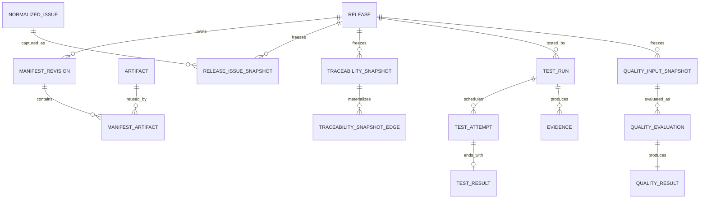
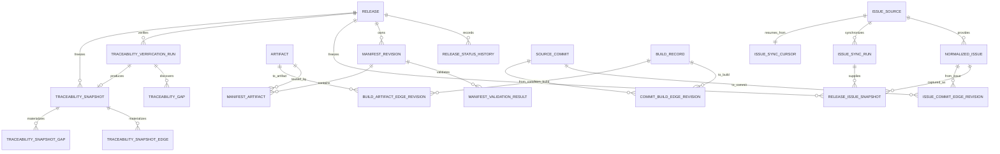
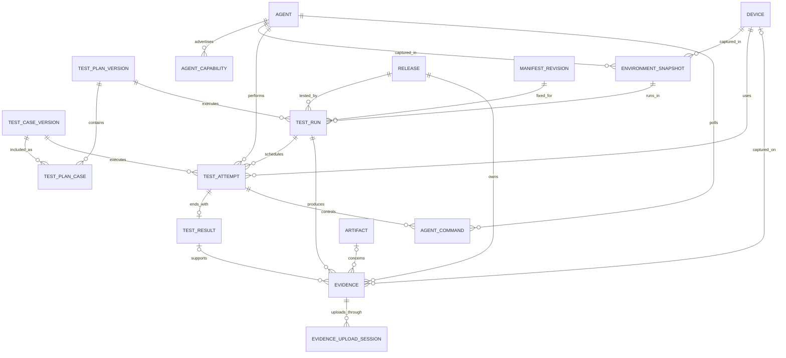
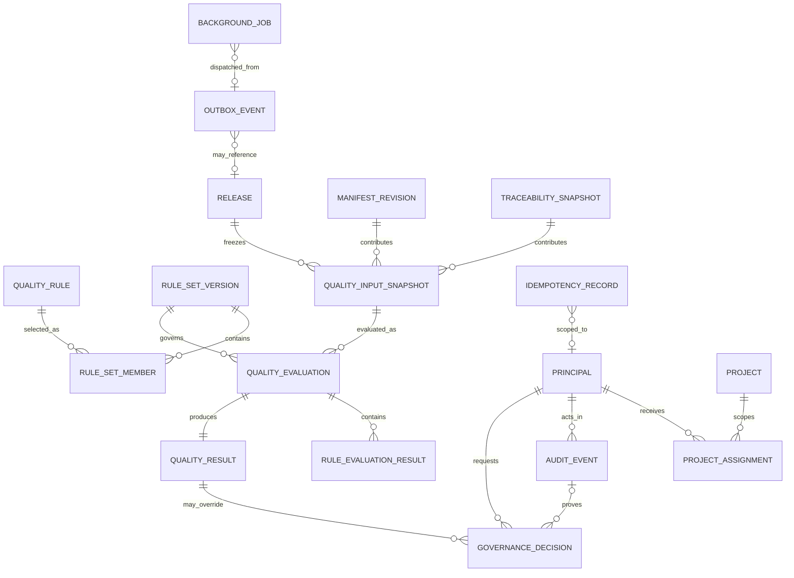

# 02 — Database Architecture and ER Model

## 1. Decision Summary

Structured data uses one PostgreSQL instance. Evidence Payloads use S3-compatible Object Storage. See [TDR-003](tdr/TDR-003-postgresql.md) and [TDR-004](tdr/TDR-004-s3-compatible-evidence-storage.md) for rationale and alternatives.

The Modular Monolith uses one database and transaction manager, with tables grouped by domain prefixes. MVP uses one schema to avoid premature migration and permission complexity. Exactly one domain module owns writes to each table. The database is not an integration bus that bypasses module interfaces.

Three authority decisions apply:

1. Build→Artifact is expressed only by versioned Traceability Edges; `artifact` does not store `build_id`.
2. Artifact→Release is derived only from the Release's Locked Manifest; no independently writable relationship table exists.
3. Historical Traceability Snapshots materialize complete Edge Facts. Later verification can only create new Edge Revisions and Snapshots.

## 2. Common Conventions

- Primary keys: `uuid`, generated as UUIDv7 by the application. External business identifiers have separate unique keys.
- Time: UTC `timestamptz`; every entity has `created_at`. Only mutable current-state records have `updated_at` and optimistic-lock `row_version`.
- Enums: MVP uses CHECK-constrained `varchar` to avoid PostgreSQL enum migration friction.
- JSONB: only versioned raw Snapshots, Rule documents, and extension Metadata. Identity, relationships, state, and frequent filter fields must be structured columns.
- External versions: `source_version` is a non-null `varchar(255)` and is an opaque identifier within one Source. It must not be parsed as an integer or ordered across Sources.
- Deletion: Release history, Snapshots, Results, Audit, and published definitions are not physically deleted. Temporary sessions and runtime telemetry may be removed only by explicit retention policy.
- Numbers: canonical units are mandatory; durations use milliseconds.
- FKs: every FK column is indexed. Columns referenced by a Composite FK have a matching UNIQUE.
- Immutable records: least-privilege database roles plus Triggers that reject UPDATE/DELETE protect them. A revision uses INSERT and never overwrites an old row.

## 3. ER View Guide

No single diagram can remain readable while showing every column. The Core ER Overview comes first, followed by complete persistent relationships by domain. Every entity in a diagram must occur in the Section 8 Table Catalog. The `artifact_release_edge_v` view is not a writable entity.

### 3.1 Core ER Overview



### 3.2 Release, Issue, and Traceability ER



### 3.3 Test, Agent, and Evidence ER



### 3.4 Quality, Identity, Audit, and Operations ER



## 4. Release, Manifest, and Artifact

| Table | PK | Key FK | UNIQUE / CHECK | Lifecycle |
|---|---|---|---|---|
| `release` | `id` | `locked_manifest_id → manifest_revision.id` (late binding) | `release_id`; state CHECK | retained permanently |
| `release_status_history` | `id` | `release_id → release.id`, `actor_id → principal.id` | `(release_id, sequence_no)` | Append-only |
| `manifest_revision` | `id` | `release_id → release.id` | `(release_id, revision)`, `content_digest` | immutable after REGISTERED |
| `manifest_validation_result` | `id` | `manifest_revision_id → manifest_revision.id` | `(manifest_revision_id, validator_version)` | Append-only |
| `artifact` | `id` | no Build FK | `artifact_id`, `(checksum_algorithm, checksum_value)` | content-addressed and reusable |
| `manifest_artifact` | `(manifest_revision_id, artifact_id)` | both sides | `(manifest_revision_id, ordinal)`; `required NOT NULL` | immutable with Revision |

`release.locked_manifest_id` starts null. A Lock transaction validates that the Manifest belongs to the Release before writing LOCKED state, the Release reference, Status History, Audit, and Outbox. A partial unique index permits at most one LOCKED Manifest per Release. Artifact has no `build_id`; Build provenance is queried only through `build_artifact_edge_revision`.

The authoritative Artifact→Release relationship is this read-only view:

```sql
CREATE VIEW artifact_release_edge_v AS
SELECT r.id AS release_id,
       mr.id AS manifest_revision_id,
       mr.revision AS manifest_revision,
       mr.content_digest AS manifest_digest,
       ma.artifact_id,
       ma.required,
       ma.ordinal
FROM release r
JOIN manifest_revision mr ON mr.id = r.locked_manifest_id
JOIN manifest_artifact ma ON ma.manifest_revision_id = mr.id
WHERE mr.state = 'LOCKED';
```

The view returns members of the Locked Manifest and carries Manifest Revision ID, Manifest digest, `required`, and ordinal. It exposes no INSERT/UPDATE/DELETE and must not be cached as another writable relationship.

## 5. Issue and External Version

| Table | PK | Key FK | UNIQUE / CHECK | Lifecycle |
|---|---|---|---|---|
| `issue_source` | `id` | credential reference, not a Secret | `source_key` | disable without deleting history |
| `normalized_issue` | `id` | `source_id → issue_source.id` | `(source_id, source_issue_id, source_version)` | Append-only per external version |
| `issue_sync_run` | `id` | `source_id → issue_source.id` | `sync_run_id` | retain summary permanently |
| `issue_sync_cursor` | `source_id` | `source_id → issue_source.id` | one Cursor per Source | mutable current Cursor |
| `release_issue_snapshot` | `id` | `release_id`, `issue_id`, `sync_run_id` | `(release_id, snapshot_version, issue_id)` | Append-only |

`normalized_issue.source_version` is an opaque string within one Source. It can preserve an ETag, update timestamp, Revision Token, or lossless string form of a number. Equality applies only within one `issue_source`. Ordering uses `observed_at` and a local sequence and does not interpret `source_version`.

## 6. Traceability Edge Revision and Snapshot

### 6.1 Persisted Edge

Three external provenance Edge types are persisted: `issue_commit_edge_revision`, `commit_build_edge_revision`, and `build_artifact_edge_revision`. Every row is an immutable Revision with these common columns:

- `id`: UUIDv7 PK for this Revision.
- `edge_id`: stable UUID of the logical Edge.
- `revision`: integer beginning at 1; UNIQUE `(edge_id, revision)`.
- Strongly typed FKs at both ends; endpoints never change for one `edge_id`.
- `source_type`, `source_reference`, and `evidence_id`.
- `confidence`, `verification_status`, `verified_at`, `verified_by`, and `reason`.
- `validator_version`, `previous_revision_id`, `previous_revision`, `content_digest`, and `created_at`.

When repeated synchronization finds the same Fact and content digest, it returns the existing Revision. A changed verification status, Confidence, or proof INSERTs `revision + 1` and never UPDATEs. Each table adds UNIQUE `(id, edge_id, revision)`, and Composite FK `(previous_revision_id, edge_id, previous_revision) → (id, edge_id, revision)` references the preceding row of the same logical Edge. A row-local CHECK requires all previous fields to be null for Revision 1 and `previous_revision = revision - 1` otherwise. A Deferred Constraint Trigger also rejects endpoint or source-identity changes under one `edge_id`. Database roles reject UPDATE/DELETE on Edge Revisions.

Artifact→Release has no Revision table. The Snapshot transaction reads `artifact_release_edge_v` and creates a materialized Edge Fact whose Source is MANIFEST, preserving Locked Manifest as the sole authority. Its `source_edge_id` is deterministically derived from Manifest Revision ID and Artifact ID; `source_edge_revision` uses the Manifest revision. These fields provide historical identity and digest input only and do not form a writable relationship.

### 6.2 Materialized Snapshot

`traceability_snapshot` stores `release_id`, `version`, `verification_run_id`, `schema_version`, `policy_version`, `content_digest`, and `created_at`, with UNIQUE `(release_id, version)` and `content_digest`.

`traceability_snapshot_edge` stores a complete Fact rather than only an Edge ID:

- `snapshot_id` and `ordinal` form the composite PK.
- `edge_type`, `from_entity_type`, `from_entity_id`, `to_entity_type`, and `to_entity_id`.
- `source_edge_id`, `source_edge_revision`, `source_type`, and `source_reference`.
- `confidence`, `verification_status`, `verified_at`, `validator_version`, and `reason`.
- `evidence_id` and `fact_digest`.

`traceability_snapshot_gap` similarly materializes expected edge, Issue/Release, reason, diagnostic code, and gap digest. UPDATE/DELETE is prohibited after the transaction creating Snapshot, Snapshot Edge, and Snapshot Gap commits. Snapshot digest is computed from all Edge Fact/Gap digests in stable ordinal order. Replay must not look up the newest Edge Revision.

## 7. PostgreSQL-Enforceable Consistency Constraints

### 7.1 Composite FK Between Evidence and Test

A PostgreSQL CHECK cannot query another row, so it is not used to claim that a Test Result belongs to the same Run. These structural constraints apply:

```text
test_run:
  UNIQUE (id, release_id)

test_attempt:
  FK (test_run_id) → test_run(id)
  UNIQUE (id, test_run_id)

test_result:
  test_run_id NOT NULL
  FK (attempt_id, test_run_id) → test_attempt(id, test_run_id)
  UNIQUE (id, test_run_id)
  UNIQUE (attempt_id)

evidence:
  release_id NOT NULL
  test_run_id NOT NULL
  test_result_id NULL
  FK (test_run_id, release_id) → test_run(id, release_id)
  FK (test_result_id, test_run_id) → test_result(id, test_run_id)
```

An Evidence row therefore cannot reference a Run from another Release or a Result from another Run. `test_result_id IS NULL` means Run-level Evidence; a non-null value must satisfy the Composite FK. The application transaction validates that optional Evidence `artifact_id` belongs to the Release's Locked Manifest and records the Manifest digest in Evidence Metadata. This is not a second Artifact→Release source.

### 7.2 Other Strong Constraints

1. A Release must have `locked_manifest_id` before entering `READY_FOR_TEST`.
2. A Locked Manifest belongs to the same Release and has a non-empty Artifact set.
3. V0.2 Artifact checksum accepts only SHA-256 and validates character form.
4. Test Run stores `(release_id, manifest_revision_id)` plus the Locked Manifest digest and is immutable after creation.
5. Attempt numbers increase from 1; terminal state cannot return to running.
6. AVAILABLE Evidence has object key, size, checksum, and Collector Version.
7. Quality Evaluation references only a COMPLETE Quality Input Snapshot and PUBLISHED Rule Set.
8. `ERROR`, missing, or inconsistent input cannot become PASS through a default.
9. Manual Edges and Governance Decisions require actor, reason, and Audit Event.

Application transactions enforce cross-aggregate state. Any invariant expressible with FK, UNIQUE, NOT NULL, or row-local CHECK must also be enforced by the database. Broad exception handling must not hide constraint failure.

## 8. Complete Table Catalog

### 8.1 Test, Agent, and Evidence

| Table | PK | Key FK | UNIQUE / Cardinality | Deletion and Retention |
|---|---|---|---|---|
| `test_plan_version` | `id` | none | `(plan_id, version)`; 1:N Revision | immutable after PUBLISHED |
| `test_case_version` | `id` | none | `(case_id, version)`; 1:N Revision | immutable after PUBLISHED |
| `test_plan_case` | `(plan_version_id, case_version_id)` | Plan, Case | `(plan_version_id, ordinal)`; M:N | retained with Plan |
| `device` | `id` | none | `device_id`; Device 1:N Snapshot/Attempt | revoke, retain history |
| `agent` | `id` | `principal_id` | `agent_id`; Agent 1:N Capability/Command | REVOKED, retain history |
| `agent_capability` | `id` | `agent_id` | `(agent_id, capability, version)` | retain old capabilities |
| `environment_snapshot` | `id` | `device_id`, `agent_id` | `content_digest`; 1:N Run | Append-only |
| `test_run` | `id` | Release, Manifest, Plan, Environment | `test_run_id`, `(id, release_id)` | no physical deletion |
| `test_attempt` | `id` | Run, Case, Agent, Device | `(test_run_id, case_version_id, attempt_no)`, `(id, test_run_id)` | Append-only state history |
| `test_result` | `id` | `(attempt_id, test_run_id)` | `attempt_id`, `(id, test_run_id)`; Attempt 0..1 Result | Append-only |
| `agent_command` | `id` | Agent, Attempt | `command_id`, `idempotency_key`; Attempt 1:N | archive Payload by policy |
| `evidence` | `id` | `(test_run_id, release_id)`, `(test_result_id, test_run_id)`, Device, Artifact | `evidence_id`; Run 1:N | retain Metadata |
| `evidence_upload_session` | `id` | `evidence_id` | `object_key`; Evidence 1:N Session | clean when expired, retain summary |

### 8.2 Quality, Identity, Governance, and Operations

| Table | PK | Key FK | UNIQUE / Cardinality | Deletion and Retention |
|---|---|---|---|---|
| `quality_rule` | `id` | author/reviewer Principal | `(rule_id, version)`, `content_digest` | immutable after PUBLISHED |
| `rule_set_version` | `id` | publisher Principal | `(rule_set_id, version)`, `content_digest` | immutable after PUBLISHED |
| `rule_set_member` | `(rule_set_version_id, rule_id, rule_version)` | Rule Set, Rule | Rule Set 1:N Member | retained with Rule Set |
| `quality_input_snapshot` | `id` | Release, Manifest, Issue/Trace Snapshot | `input_digest`; Release 1:N | Append-only |
| `quality_evaluation` | `id` | Input Snapshot, Rule Set | `evaluation_id`, composite idempotency key | Append-only |
| `rule_evaluation_result` | `id` | Evaluation, Rule | `(evaluation_id, rule_id, rule_version)` | Append-only |
| `quality_result` | `id` | `evaluation_id` | `evaluation_id`, `result_digest`; Evaluation 1:1 | Append-only |
| `principal` | `id` | none | `(issuer, subject)` | disable, retain history |
| `project` | `id` | none | `project_key` | archive, retain historical references |
| `project_assignment` | `(principal_id, project_id, role)` | Principal, Project | same PK; M:N | revoke with Audit |
| `audit_event` | `id` | optional actor Principal | `event_id`, `(request_id, sequence_no)` | Append-only, formal archive |
| `governance_decision` | `id` | Quality Result, requester, approver, Audit | `decision_id`; Result 1:N | Append-only, never rewrite algorithm Result |
| `idempotency_record` | `id` | optional Principal | `(scope, principal_id, idempotency_key)` | clean after retry window |
| `outbox_event` | `id` | optional Release | `event_id`; Domain Transaction 1:N | archive after publication |
| `background_job` | `id` | optional Outbox Event | `(job_type, idempotency_key)` | retain completion summary; never auto-delete Dead Letter |

### 8.3 Additional Release, Issue, and Traceability Entities

| Table | PK | Key FK | UNIQUE / Cardinality | Deletion and Retention |
|---|---|---|---|---|
| `source_commit` | `id` | repository reference | `(repository, commit_id)`; Commit 1:N Edge Revision | no physical deletion |
| `build_record` | `id` | provider reference | `(provider, build_id)`; Build 1:N Edge Revision | no physical deletion |
| `issue_commit_edge_revision` | `id` | Issue, Commit, previous Revision, optional Evidence | `(edge_id, revision)`; logical Edge 1:N Revision | Append-only |
| `commit_build_edge_revision` | `id` | Commit, Build, previous Revision, optional Evidence | `(edge_id, revision)`; logical Edge 1:N Revision | Append-only |
| `build_artifact_edge_revision` | `id` | Build, Artifact, previous Revision, optional Evidence | `(edge_id, revision)`; logical Edge 1:N Revision | Append-only |
| `traceability_verification_run` | `id` | Release, policy version | `verification_run_id`; Release 1:N | Append-only |
| `traceability_gap` | `id` | Verification Run, Release, optional Issue | `(verification_run_id, gap_digest)` | Append-only |
| `traceability_snapshot` | `id` | Release, Verification Run | `(release_id, version)`, `content_digest` | Append-only |
| `traceability_snapshot_edge` | `(snapshot_id, ordinal)` | Snapshot, optional Evidence | `(snapshot_id, fact_digest)` | Append-only |
| `traceability_snapshot_gap` | `(snapshot_id, ordinal)` | Snapshot | `(snapshot_id, gap_digest)` | Append-only |

The remaining tables in Sections 4 through 6 are also part of the Complete Table Catalog. A Migration Review for any new persistent entity must add its PK, FK, Cardinality, and Retention here. An ORM Entity that appears only in code is not acceptable.

## 9. Transaction Boundaries

- Create Release: Release + initial Status History + Audit + Outbox in one transaction.
- Register Manifest: Revision + Artifact links + Validation Result in one transaction.
- Lock Manifest: integrity recheck + Lock + Release reference + Status History + Audit + Outbox in one transaction.
- Verify Traceability: Verification Run + new Edge Revisions + Gaps in bounded transactions, followed by one transaction that creates the immutable Snapshot.
- Create Test Run: Run + Locked Manifest identity + Environment Snapshot reference + Audit + Outbox in one transaction.
- Complete Test Result: Attempt terminal state + Result + Outbox in one transaction; Evidence upload completes separately.
- Complete Evidence: after object Metadata verification, Evidence state + Audit + Outbox in one transaction.
- Publish Rule Set: Rule validation + Version publication + Audit in one transaction.
- Complete Evaluation: Input Snapshot + Rule Results + Quality Result + Release Status History in one transaction.

Object Storage cannot join the database transaction. An upload state machine, checksum, and reconciliation provide recoverable consistency; the design does not claim distributed atomicity.

## 10. Indexes, Lifecycle, and Migration

Required MVP indexes: Release `(project, created_at DESC)`; Snapshot `(release_id, version DESC)`; Edge `(edge_id, revision DESC)`, both endpoint FKs, and `(verification_status, confidence)`; Run/Attempt `(release_id, created_at DESC)` and `(agent_id, state, lease_expires_at)`; Evidence `(release_id, type, captured_at)` and `(test_run_id, upload_state)`; Quality `(release_id, created_at DESC)`; Audit `(resource_type, resource_id, occurred_at)`.

Release/Manifest/Traceability/Quality, Issue Snapshot, Test Result, Evidence Metadata, and Audit are not physically deleted during the audit period. Evidence Payload can be tiered or deleted by project retention only with no legal hold, an Audit Event, retained Metadata, and continued explainability of historical Results. Upload Sessions, Heartbeats, completed Jobs, and Idempotency Records may be cleaned by explicit periods.

Flyway Migrations are forward-only and named `V<sequence>__<meaning>.sql`. Use Expand → Migrate → Contract. Applied scripts are immutable, and destructive Contract waits at least one compatible release. Every release rehearses Migration and recovery against a copy of the previous-version backup. Deployment records link application, Schema, and Git commit.

## 11. Constraint Integration Test

These tests must use real PostgreSQL, not H2 or a Mock:

1. Concurrent Lock on one Release has exactly one success and no partial write.
2. The `artifact` Schema has no `build_id`; Build→Artifact is queryable only through Edge Revision.
3. An Artifact outside the Locked Manifest does not appear in `artifact_release_edge_v`.
4. Updating Edge state INSERTs a new Revision; old Revision, old Snapshot Edge, and digest remain unchanged.
5. Composite FK rejects Evidence with `(test_run_id, release_id)` from different Releases.
6. Composite FK rejects Evidence with `(test_result_id, test_run_id)` from different Runs.
7. ETags and non-numeric Revision Tokens round-trip losslessly through `source_version`.
8. Permissions or Triggers reject UPDATE/DELETE of Snapshot, Edge Revision, Quality Result, and Audit.
9. Duplicate Adapter/Agent/API requests do not create duplicate entities.
10. Any Quality Result resolves to fixed Manifest, Issue/Trace Snapshot, Test Result, Evidence, and Rule Set.

Acceptance evidence: Schema export, Migration Test, Constraint Integration Test, concurrency tests, Snapshot Replay digest, sample Explain Plans, backup/restore records, and data-consistency inspection reports.

## 12. Failure and Recovery

- Database unavailable: writes fail explicitly; no in-memory buffering may claim success.
- Transaction conflict: return 409 from optimistic locking; caller reads current state before deciding whether to retry.
- Migration failure: stop deployment and restore the old application; recover a backup for irreversible changes according to rehearsal.
- Primary corruption: restore backup + WAL/PITR, then reconcile Evidence Object inventory against Metadata.
- Data inconsistency: quarantine affected Release, reject Quality Evaluation, and emit an auditable diagnostic.
