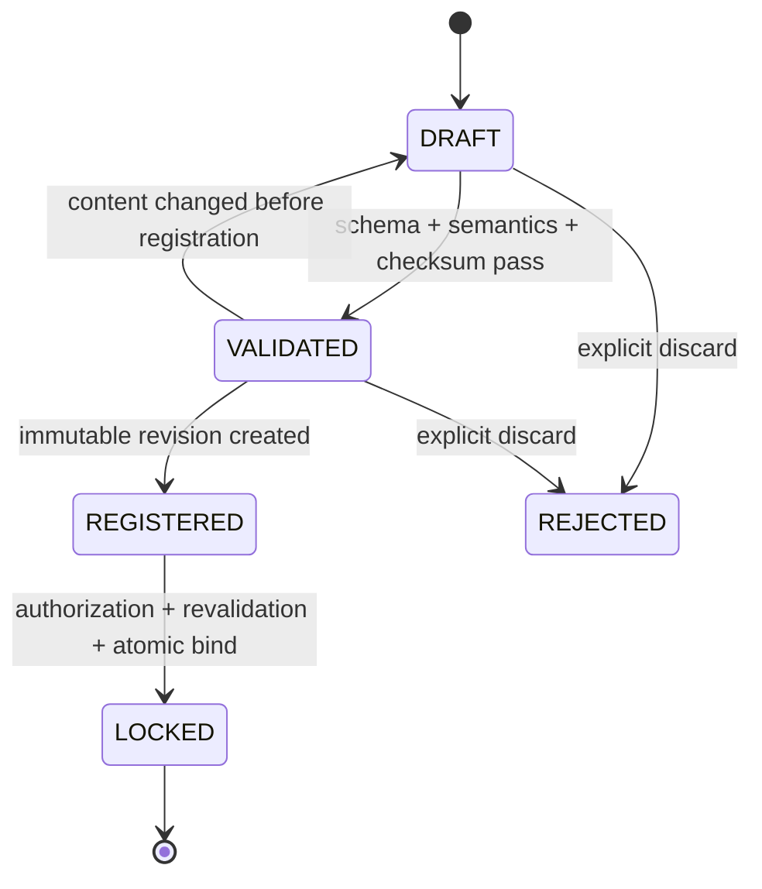

# 04 — Release Manifest Lifecycle

## 1. Authority Principle

Release Manifest is the only authoritative definition of Release contents. Changes to APK, Jira Version, Build Number, Git Branch, or an external system may only become new inputs and must never automatically modify an existing Release or Locked Manifest.

## 2. Lifecycle



### Create

Creating a Draft binds the target `releaseId` and Manifest schema version. A Draft can be revised but is not the authoritative Release definition.

### Validate

Execute in order:

1. JSON Schema: required fields, types, enums, and unknown fields.
2. Semantics: matching Release ID, unique Artifact IDs, and valid type-specific fields.
3. Completeness: at least one Artifact; no required Artifact is missing.
4. Identity: verifiable APK package/version/signing fingerprint, Image build identity, and similar fields.
5. Checksum: read the actual Artifact or trusted build metadata and validate SHA-256.

Every validation produces an immutable Validation Report containing schema, validator version, input digest, itemized Results, and time. Inaccessible Artifacts cause validation failure or explicit INCOMPLETE status and must not pass.

### Register

Registration freezes normalized JSON, content digest, Artifact associations, and Validation Report as an immutable Revision. A repeated request with the same Release and content digest returns the original Revision.

### Lock

Lock requires an authorized caller, a Revision belonging to the Release, still-valid validation, unchanged Artifact checksums, a Release state that permits Lock, and no existing Locked Manifest.

One database transaction writes Manifest state, Release `lockedManifestId`, Release state, Audit, and Outbox. Exactly one concurrent Lock succeeds.

## 3. Release State Coordination

```text
Create Release(DRAFT)
→ Register Manifest: Release REGISTERED
→ Lock Manifest: Release READY_FOR_TEST
→ Create Run: TESTING
→ Complete Evaluation: QUALITY_EVALUATED (references separate PASS/WARNING/BLOCK Quality Result)
→ Governance complete: COMPLETED
```

`COMPLETED` does not overwrite Quality status. The final view shows both the algorithmic Quality Result and governance state.

## 4. Version and Compatibility

- `manifestVersion` is the document schema major/minor.
- `revision` is an immutable candidate version before Lock for the same Release.
- The V0.1 Schema `schemas/release-manifest.schema.json` remains unchanged. V0.2 uses separate `schemas/v0.2/release-manifest.schema.json` and must not overwrite or silently upgrade historical documents.
- Reading an old Manifest with a new schema requires an interpreter; never silently rewrite Locked documents in the background.
- After testing starts, a content change in V0.2 must create a new Release, avoiding acceptance ambiguity from multiple authoritative versions under one Release.

### 4.1 V0.2 Schema Semantics

The machine-executable Schema is [`schemas/v0.2/release-manifest.schema.json`](../../schemas/v0.2/release-manifest.schema.json), with examples registered in [`contracts/examples/v0.2/validation-cases.json`](../../contracts/examples/v0.2/validation-cases.json). Contract Tests verify the frozen V0.1 file against a fixed SHA-256; V0.2 assets do not overwrite it.

Required common Artifact fields in V0.2 are artifactId, type, name, version, source, checksum.algorithm, checksum.value, and `required`. `required` must be an explicit boolean. Its absence is a Schema Error. JSON Schema default is not applied, and implementations must not infer true or false.

Type identity fields: APK requires packageName, string versionCode, and signingCertificateSha256. SYSTEM_IMAGE/VENDOR_IMAGE require buildId and buildFingerprint. FIRMWARE/CONFIG require target and version identity. OTHER requires a type-specific identity map whose keys are allowlisted by Schema. Unknown write fields are rejected.

### 4.2 Canonicalization and Digest

1. Input first passes V0.2 JSON Schema and semantic validation. Duplicate JSON keys, non-NFC Unicode strings, floating/exponent forms, and JSON integers outside `[-(2^53)+1, (2^53)-1]` are rejected. Numeric identities that may exceed this range use decimal strings.
2. Validated JSON produces canonical bytes using RFC 8785 JSON Canonicalization Scheme (JCS). JCS applies no business defaults, trimming, case conversion, or Unicode normalization.
3. Canonical bytes use UTF-8 without BOM or trailing newline. `contentDigest` is SHA-256 over those bytes, encoded as `sha256:<lowercase-hex>`.
4. Artifact order is Manifest semantics and is not reordered. JCS determines Object property order.
5. Validation Report stores schema ID/version, canonicalization ID `RFC8785-JCS-1`, validator version, canonical byte length, and digest.
6. Lock accepts only a `VALID` Report whose database fact columns exactly match its Report JSON and whose `validatorVersion` is present in the deployment allowlist. The allowlist is empty by default and therefore denies Lock. Lock snapshots the supporting `validationId`, so later Reports cannot change the authoritative export.

Canonicalization Fixtures cover property order, Unicode, escapes, integer boundary, Artifact order, explicit `required=false`, and missing required. At least the JVM implementation and one independent implementation must produce identical canonical bytes/digest. Any difference blocks Lock.

Production deployments must integrate a trusted validator that can read Artifact payloads and recompute checksums, then configure its exact version through `VSRQG_TRUSTED_MANIFEST_VALIDATOR_VERSIONS`. Without that integration, built-in validation produces only `INCOMPLETE`, and the system must deny Lock rather than treating a declared checksum as a verified fact.

## 5. Failure Handling

- Schema/semantic failure: return 422 with field-level violations.
- Checksum mismatch: mark INVALID and record expected/actual; Lock is prohibited.
- Artifact inaccessible: explicit INCOMPLETE, eligible for revalidation.
- Concurrent modification: If-Match mismatch returns 409.
- Lock transaction failure: roll back everything.
- External Artifact replaced after Lock: the original Release still points to the original checksum. Create a new Release and raise a security alert against the source system.

## 6. MVP and Deferred Scope

MVP supports APK, SYSTEM_IMAGE, VENDOR_IMAGE, FIRMWARE, CONFIG, OTHER from the current schema, SHA-256, and pre-Lock Revisions. Signing-chain governance, supplier SBOM, and Manifest signatures are deferred while retaining schema/version extension points.

## 7. Acceptance Scenarios

1. Re-registering identical input returns the same Manifest.
2. Two actors Lock concurrently and exactly one succeeds.
3. After Lock, neither database nor API can modify content or the Artifact set.
4. External APK, Jira Version, Branch, or Build changes do not alter Release.
5. Checksum mismatch, missing Artifact, or unknown Schema cannot enter testing.
6. A Quality Result traces back to the Locked Manifest source, digest, and Validation Report.
7. Property order in semantically identical JSON does not affect digest; changing Artifact array order does.
8. Missing `required`, a non-NFC string, or a non-canonical number cannot register a V0.2 Manifest.

Acceptance evidence: state-machine contract tests, concurrency tests, V0.1/V0.2 Schema Compatibility Tests, cross-implementation Canonicalization Fixtures, Validation Reports, Audit Events, exported Locked Manifest, and checksum revalidation.
