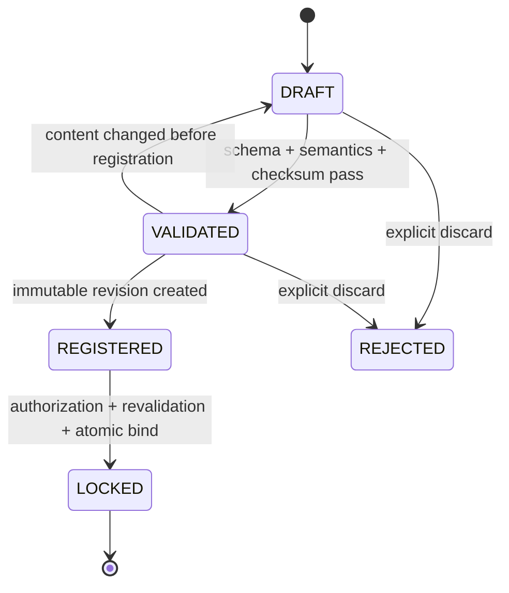

# 04 — Release Manifest Lifecycle

## 1. Authority Principle

Release Manifest is the only authoritative definition of Release contents. Changes to APK, Jira Version, Build Number, Git Branch, or an external system may only become new inputs and must never automatically modify an existing Release or Locked Manifest.

## 2. Lifecycle



### Create

Creating a Draft binds the target `releaseId` and Manifest schema version. A Draft can be revised but is not the authoritative Release definition.

### Validate

Execute in order:

1. JSON Schema: required fields, types, enums, and unknown fields.
2. Semantics: matching Release ID, unique Artifact IDs, and valid type-specific fields.
3. Completeness: at least one Artifact; no required Artifact is missing.
4. Identity: verifiable APK package/version/signing fingerprint, Image build identity, and similar fields.
5. Checksum: read the actual Artifact or trusted build metadata and validate SHA-256.

Every validation produces an immutable Validation Report containing schema, validator version, input digest, itemized Results, and time. Inaccessible Artifacts cause validation failure or explicit INCOMPLETE status and must not pass.

### Register

Registration freezes normalized JSON, content digest, Artifact associations, and Validation Report as an immutable Revision. A repeated request with the same Release and content digest returns the original Revision.

### Lock

Lock requires an authorized caller, a Revision belonging to the Release, still-valid validation, unchanged Artifact checksums, a Release state that permits Lock, and no existing Locked Manifest.

One database transaction writes Manifest state, Release `lockedManifestId`, Release state, Audit, and Outbox. Exactly one concurrent Lock succeeds.

## 3. Release State Coordination

```text
Create Release(DRAFT)
→ Register Manifest: Release REGISTERED
→ Lock Manifest: Release READY_FOR_TEST
→ Create Run: TESTING
→ Complete Evaluation: QUALITY_EVALUATED (references separate PASS/WARNING/BLOCK Quality Result)
→ Governance complete: COMPLETED
```

`COMPLETED` does not overwrite Quality status. The final view shows both the algorithmic Quality Result and governance state.

## 4. Version and Compatibility

- `manifestVersion` is the document schema major/minor.
- `revision` is an immutable candidate version before Lock for the same Release.
- Normalized JSON uses stable field order and encoding to generate `contentDigest`.
- Reading an old Manifest with a new schema requires an interpreter; never silently rewrite Locked documents in the background.
- After testing starts, a content change in V0.2 must create a new Release, avoiding acceptance ambiguity from multiple authoritative versions under one Release.

## 5. Failure Handling

- Schema/semantic failure: return 422 with field-level violations.
- Checksum mismatch: mark INVALID and record expected/actual; Lock is prohibited.
- Artifact inaccessible: explicit INCOMPLETE, eligible for revalidation.
- Concurrent modification: If-Match mismatch returns 409.
- Lock transaction failure: roll back everything.
- External Artifact replaced after Lock: the original Release still points to the original checksum. Create a new Release and raise a security alert against the source system.

## 6. MVP and Deferred Scope

MVP supports APK, SYSTEM_IMAGE, VENDOR_IMAGE, FIRMWARE, CONFIG, OTHER from the current schema, SHA-256, and pre-Lock Revisions. Signing-chain governance, supplier SBOM, and Manifest signatures are deferred while retaining schema/version extension points.

## 7. Acceptance Scenarios

1. Re-registering identical input returns the same Manifest.
2. Two actors Lock concurrently and exactly one succeeds.
3. After Lock, neither database nor API can modify content or the Artifact set.
4. External APK, Jira Version, Branch, or Build changes do not alter Release.
5. Checksum mismatch, missing Artifact, or unknown Schema cannot enter testing.
6. A Quality Result traces back to the Locked Manifest source, digest, and Validation Report.

Acceptance evidence: state-machine contract tests, concurrency tests, Validation Reports, Audit Events, exported Locked Manifest, and checksum revalidation.
