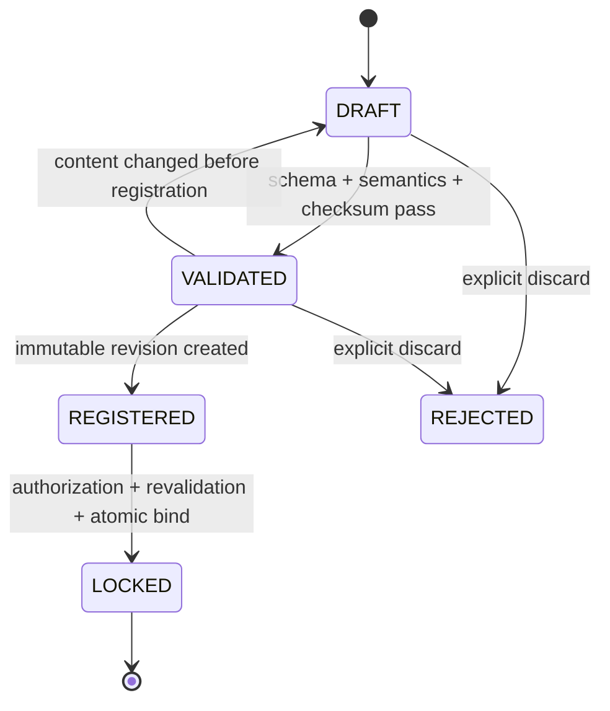

# 04 — Release Manifest Lifecycle

## 1. 权威原则

Release Manifest 是 Release 内容的唯一权威定义。APK、Jira Version、Build Number、Git Branch 或外部系统变化只能成为新输入，绝不能自动修改已创建 Release 或已锁定 Manifest。

## 2. 生命周期



### 创建

创建草稿时绑定目标 `releaseId` 和 Manifest schema version。草稿允许修订，但不是 Release 权威定义。

### 校验

按顺序执行：

1. JSON Schema：必填字段、类型、枚举、未知字段。
2. 语义：Release ID 匹配、Artifact ID 唯一、类型专属字段合理。
3. 完整性：至少一个 Artifact；required Artifact 不缺失。
4. 身份：APK package/version/signing fingerprint、Image build identity 等可验证字段。
5. checksum：读取实际 Artifact 或可信构建元数据并验证 SHA-256。

每次校验生成不可变 Validation Report，记录 schema、validator version、输入 digest、逐项结果和时间。无法访问 Artifact 时校验失败或保持明确 INCOMPLETE，不得通过。

### 注册

注册把规范化 JSON、内容 digest、Artifact 关联和 Validation Report 固化为不可变 Revision。相同 Release + 内容 digest 的重复请求返回原 Revision。

### Lock

Lock 必须满足：调用者有权限；Revision 属于该 Release；校验仍有效；Artifact checksum 未变化；Release 仍允许 Lock；不存在已锁定 Manifest。

一个数据库事务完成 Manifest 状态、Release `lockedManifestId`、Release 状态、审计和 Outbox。并发 Lock 只有一个成功。

## 3. Release 状态协作

```text
Create Release(DRAFT)
→ Register Manifest: Release REGISTERED
→ Lock Manifest: Release READY_FOR_TEST
→ Create Run: TESTING
→ Complete Evaluation: QUALITY_EVALUATED（关联独立的 PASS/WARNING/BLOCK Quality Result）
→ Governance complete: COMPLETED
```

`COMPLETED` 不覆盖质量状态；最终页面同时显示算法 Quality Result 和治理状态。

## 4. 版本与兼容

- `manifestVersion` 表示文档 schema major/minor。
- `revision` 表示同一 Release Lock 前的不可变候选版本。
- 规范化 JSON 使用稳定字段排序和编码生成 `contentDigest`。
- 新 schema 读取旧 Manifest 必须有解释器；禁止后台静默改写已锁定文档。
- 一旦测试开始，内容变化在 V0.2 必须创建新 Release，避免同 Release 多权威版本造成验收歧义。

## 5. 失败处理

- Schema/语义失败：返回 422 和字段级 violation。
- checksum 不符：标记 INVALID，记录 expected/actual；不得 Lock。
- Artifact 不可访问：明确 INCOMPLETE，可重新校验。
- 并发修改：If-Match 不符返回 409。
- Lock 事务失败：全部回滚。
- Lock 后发现外部 Artifact 被替换：原 Release 仍指向原 checksum；创建新 Release，并对来源系统触发安全告警。

## 6. MVP 与延期

MVP 支持现有 schema 的 APK、SYSTEM_IMAGE、VENDOR_IMAGE、FIRMWARE、CONFIG、OTHER，SHA-256 以及 Lock 前 Revision。签名链治理、供应商 SBOM 和 Manifest 签名延期，但保留 schema/version 扩展点。

## 7. 验收场景

1. 相同输入重复注册返回相同 Manifest。
2. 两个操作者并发 Lock，只有一个成功。
3. Lock 后数据库/API 均无法修改内容或 Artifact 集合。
4. 外部 APK、Jira Version、Branch 或 Build 变化不改变 Release。
5. checksum 不符、Artifact 缺失或 Schema 未知均不能进入测试。
6. 从 Quality Result 可回溯到 Locked Manifest 原文、摘要与 Validation Report。

验收证据：状态机契约测试、并发测试、校验报告、Audit Event、已锁定 Manifest 导出与 checksum 复验。
