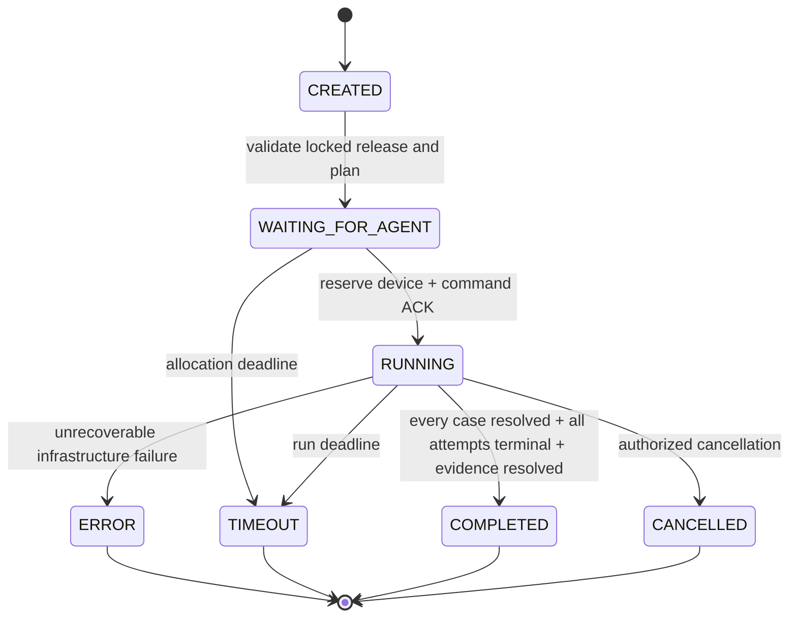
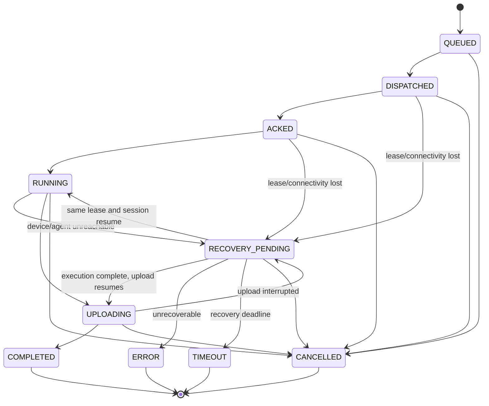

# 07 — Test Architecture

## 1. 责任分离

```text
Test Definition → Orchestrator → Agent/Executor → Collector
      ↓                ↓              ↓             ↓
 versioned plan    scheduling      actions       Evidence

Server-side Quality Engine consumes results; Orchestrator/Agent do not decide Release quality.
```

Orchestrator 负责 Plan 调度、Run 创建、Device/Agent 分配、Command、状态、Timeout、Retry 和完成汇总。不负责 PASS/WARNING/BLOCK Release Gate。

## 2. Test Definition

Test Plan Version 固定 Case Version、顺序、是否 required、参数和 retry policy。Test Case Version 包含稳定 `caseId`、preconditions、steps、expected result、required Evidence、timeout 和 capability requirements。发布后不可修改。

Retry Policy 明确：最大 attempt、可重试失败类别、backoff、Run 总期限。FAIL 默认表示已执行且不满足预期，不自动重试；ERROR/TIMEOUT 可按策略重试。

## 3. Device 与 Agent

Device 保存硬件/平台/系统/台架状态与能力；敏感序列号使用受控引用。Agent 是可认证执行端，公布 protocol version、agent version 和 capabilities。分配前创建 Environment Snapshot，固定测试时实际环境。

Device 状态：AVAILABLE、RESERVED、BUSY、OFFLINE、MAINTENANCE、QUARANTINED。Agent 心跳不能证明 Device 功能健康；设备预检必须单独通过。

## 4. Test Run 状态机



Run 完成只说明测试流程终止，不等于 Release PASS。

## 5. Attempt 与 Test Result

每个 Case 的每次执行为 Attempt。Attempt 状态：QUEUED、DISPATCHED、ACKED、RUNNING、RECOVERY_PENDING、UPLOADING、COMPLETED、ERROR、TIMEOUT、CANCELLED。



每个终态 Attempt 恰好一个不可变 Test Result；Attempt 与 Result 在同一事务进入终态。取消映射为 BLOCKED 并使用 `CANCELLED_BY_OPERATOR` 或 `RUN_CANCELLED` reason code，不得转成 PASS：

- PASS：执行完成且 expected result 满足。
- FAIL：执行完成且断言不满足。
- BLOCKED：前置条件/环境阻止有效执行。
- ERROR：工具、Agent、协议或基础设施异常。
- SKIPPED：由已发布 Plan 条件明确跳过。
- TIMEOUT：超过 Case/Command 期限。

Result 保存 failure reason code/detail、duration、Agent、Device、start/end、attemptNo 和 Evidence requirements satisfaction。不能把 ERROR/BLOCKED/SKIPPED/TIMEOUT 归为 PASS。

### Run Completion Contract

Run 进入 COMPLETED 前必须同时满足：

1. Published Plan 中每个 Case 都有终态 Resolution；未执行的 optional Case 只能依据已发布 Plan condition 创建 SKIPPED Result，不能因调度器方便而省略。
2. 所有已创建 Attempt 均处于 COMPLETED/ERROR/TIMEOUT/CANCELLED，且都有 Test Result。
3. 不存在 RUNNING、UPLOADING 或 RECOVERY_PENDING 的 optional Attempt；Run 不会为了提前完成而遗留活动 Attempt。
4. required Evidence 已 AVAILABLE，或以明确 FAILED/INTEGRITY_ERROR 进入汇总；缺失不能当作成功。

Run timeout/cancel 先以 fencing token 终止活动 Attempt 并写入对应 Result，再将 Run 置为 TIMEOUT/CANCELLED。Run COMPLETED、TIMEOUT、ERROR 或 CANCELLED 后，结果集合和输入 digest 封闭；后续事件不能改变该 Run 的事实。

## 6. 调度与租约

MVP 使用 PostgreSQL 行锁/租约选择满足 capability、vehicle/platform 和状态的 Device/Agent。租约含 owner、expiresAt 和 fencing token，防止过期 Agent 写入新一代任务。

同一 Device 同时至多一个独占 Run。分配、Command 创建和 Outbox 在事务内完成；Agent 通过协议拉取，不需要 Server 主动穿透车机网络。

## 7. Timeout、Retry 与断电

- Command timeout、Case timeout、Run timeout 分层且分别记录。
- 网络短断：租约窗口内重连并凭 commandId/attemptId 恢复。
- Device 断电：心跳/进度超时后 Attempt 进入 RECOVERY_PENDING；窗口内恢复则继续或上报已完成结果。
- 恢复窗口到期：Attempt ERROR 或 TIMEOUT，释放/隔离 Device；按已发布 Retry Policy 新建 Attempt。
- 重试不得覆盖旧 Result/Evidence，不得无限重试。
- 不确定 Agent 是否执行完成时，禁止将非幂等设备动作自动重放；Case 定义必须声明 replay safety。
- 迟到 Event/Result 必须携带 commandId、attemptId、sequence 和 fencing token。相同 digest 的重复上报返回原确认；终态后不同 digest、旧 fencing token 或乱序冲突返回 409 `LATE_EVENT_CONFLICT`/`STALE_LEASE`，写隔离诊断但不修改 Attempt/Result/Run。

## 8. Evidence 触发

Run 开始前启动要求的持续 Collector；Case 前后建立时间窗口和 context marker；异常时触发 Crash/ANR/log/screenshot 等采集。Run 只有在全部 Case Resolution、全部已创建 Attempt 和 required Evidence 均满足 Run Completion Contract 后才完成汇总。

## 9. MVP 测试范围

一台真实台架、顺序执行、基础 selector、Smoke Plan，以及 Crash、ANR、Screenshot、Log Collector 属于 MVP Mandatory。Memory 只在 MVP 中保留 Plugin Interface、Fact Contract 和 Rule Example；真实 Memory Collector 是 Stretch Goal，仅当 M1/M2 按期完成且真实台架已稳定时进入 M3。并行设备池、复杂优先级、公平调度、分布式 scheduler 延期。

## 10. 验收

- 未 Lock Manifest 的 Release 不能创建 Run。
- 不满足 capability 的 Device 不被分配。
- 断网、断电、重复 ACK/Result、超时和取消有确定终态。
- RECOVERY_PENDING、恢复窗口到期、optional Case 和迟到 Event/Result 具有状态契约测试。
- 重试产生新 Attempt 并保留旧证据。
- Run 完成不直接写 Quality Result。

证据：状态机测试、调度约束测试、断电演练视频/日志、Attempt 历史、Evidence requirements 报告。
