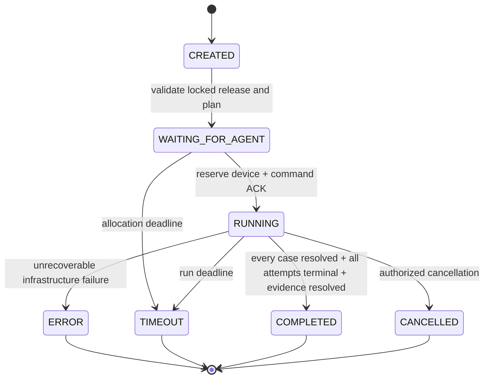
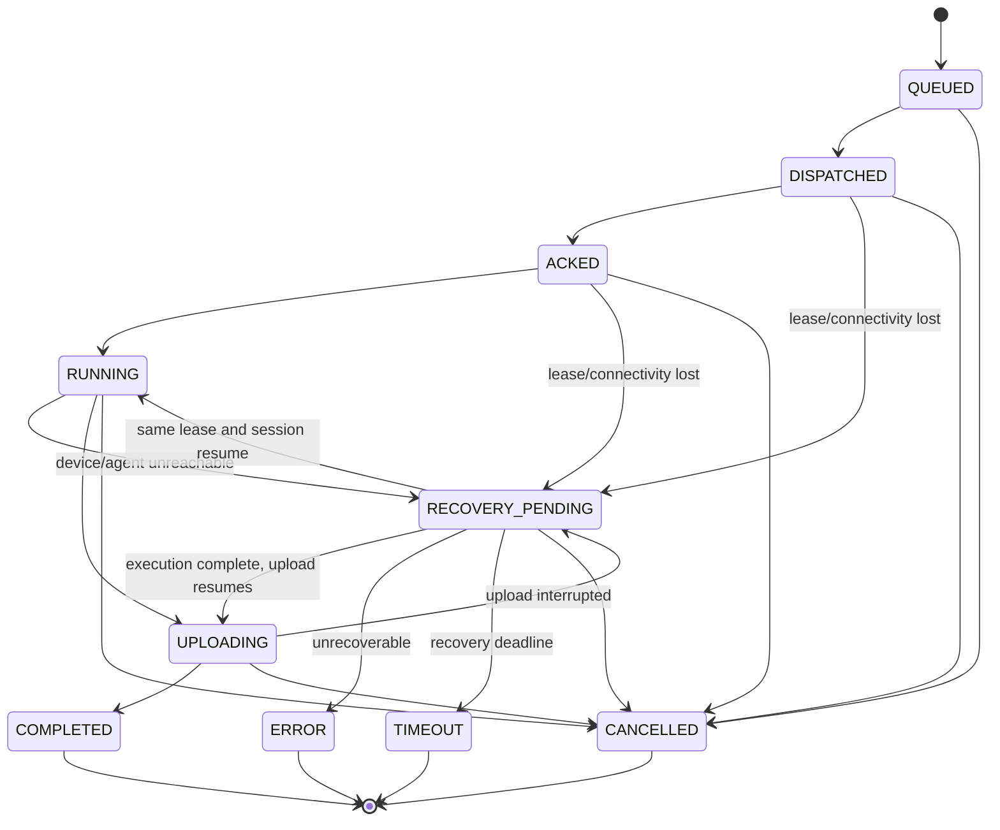

# 07 — Test Architecture

## 1. Separation of Responsibilities

```text
Test Definition → Orchestrator → Agent/Executor → Collector
      ↓                ↓              ↓             ↓
 versioned plan    scheduling      actions       Evidence

Server-side Quality Engine consumes results; Orchestrator/Agent do not decide Release quality.
```

The Orchestrator handles Plan scheduling, Run creation, Device/Agent assignment, Commands, state, Timeout, Retry, and completion aggregation. It does not decide PASS/WARNING/BLOCK for the Release Gate.

## 2. Test Definition

Test Plan Version fixes Case Versions, order, required flags, parameters, and retry policy. Test Case Version contains stable `caseId`, preconditions, steps, expected result, required Evidence, timeout, and capability requirements. It is immutable after publication.

Retry Policy specifies maximum Attempts, retryable failure categories, backoff, and total Run deadline. FAIL means execution completed without meeting expectations and is not retried by default. ERROR/TIMEOUT may be retried according to policy.

## 3. Device and Agent

Device stores hardware/platform/system/bench state and capabilities. Sensitive serial numbers use controlled references. Agent is an authenticated execution endpoint that advertises protocol version, agent version, and capabilities. Before assignment, create an Environment Snapshot that freezes the actual test environment.

Device states: AVAILABLE, RESERVED, BUSY, OFFLINE, MAINTENANCE, QUARANTINED. Agent heartbeat does not prove Device functional health; device preflight must pass separately.

## 4. Test Run State Machine



Run completion means only that the test workflow terminated; it does not mean Release PASS.

## 5. Attempt and Test Result

Each Case execution is an Attempt. Attempt states: QUEUED, DISPATCHED, ACKED, RUNNING, RECOVERY_PENDING, UPLOADING, COMPLETED, ERROR, TIMEOUT, CANCELLED.



Each terminal Attempt has exactly one immutable Test Result; Attempt and Result enter terminal state in one transaction. Cancellation maps to BLOCKED with reason code `CANCELLED_BY_OPERATOR` or `RUN_CANCELLED` and must not become PASS:

- PASS: execution completed and expected result was met.
- FAIL: execution completed and an assertion was not met.
- BLOCKED: a precondition/environment prevented valid execution.
- ERROR: tool, Agent, protocol, or infrastructure failure.
- SKIPPED: explicitly skipped by a published Plan condition.
- TIMEOUT: Case/Command deadline exceeded.

Result stores failure reason code/detail, duration, Agent, Device, start/end, attemptNo, and Evidence-requirement satisfaction. ERROR/BLOCKED/SKIPPED/TIMEOUT must not be classified as PASS.

### Run Completion Contract

A Run may enter COMPLETED only when all conditions hold:

1. Every Case in the Published Plan has a terminal Resolution. An unexecuted optional Case may create a SKIPPED Result only through a published Plan condition; scheduler convenience cannot omit it.
2. Every created Attempt is COMPLETED/ERROR/TIMEOUT/CANCELLED and has a Test Result.
3. No optional Attempt remains RUNNING, UPLOADING, or RECOVERY_PENDING. A Run cannot leave an active Attempt behind to finish early.
4. Required Evidence is AVAILABLE or enters aggregation as explicit FAILED/INTEGRITY_ERROR. Missing Evidence is not success.

Run timeout/cancel first uses the fencing token to terminate active Attempts and write their Results, then transitions Run to TIMEOUT/CANCELLED. After Run reaches COMPLETED, TIMEOUT, ERROR, or CANCELLED, its Result set and input digest are closed. Later events cannot change that Run's Facts.

## 6. Scheduling and Leases

MVP uses PostgreSQL row locks/leases to select a Device/Agent matching capability, vehicle/platform, and state. A lease includes owner, expiresAt, and fencing token to stop an expired Agent from writing to a newer task generation.

A Device may have at most one exclusive Run at a time. Assignment, Command creation, and Outbox complete in one transaction. The Agent pulls through the protocol, so the Server does not need to penetrate the head-unit network.

## 7. Timeout, Retry, and Power Loss

- Command timeout, Case timeout, and Run timeout are layered and recorded separately.
- Short network interruption: reconnect within the lease window and resume using commandId/attemptId.
- Device power loss: after heartbeat/progress timeout, Attempt enters RECOVERY_PENDING. If restored within the window, continue or report an already completed Result.
- Recovery window expiry: mark Attempt ERROR or TIMEOUT, release/quarantine Device, and create a new Attempt according to the published Retry Policy.
- Retry never overwrites old Result/Evidence and is never unbounded.
- When Agent completion is uncertain, non-idempotent device actions must not be replayed automatically. The Case definition must declare replay safety.
- A late Event/Result carries commandId, attemptId, sequence, and fencing token. A duplicate with the same digest returns the original acknowledgement. A different digest after terminal state, an old fencing token, or a conflicting out-of-order message returns 409 `LATE_EVENT_CONFLICT`/`STALE_LEASE`, writes quarantined diagnostics, and does not modify Attempt/Result/Run.

## 8. Evidence Triggers

Start required continuous Collectors before Run. Establish time windows and context markers around each Case. On abnormal behavior, trigger Crash/ANR/log/screenshot collection. Run aggregation completes only after all Case Resolutions, all created Attempts, and required Evidence satisfy the Run Completion Contract.

## 9. MVP Test Scope

One real bench, sequential execution, a basic selector, a Smoke Plan, and Crash, ANR, Screenshot, and Log Collectors are MVP Mandatory. MVP retains only the Memory Plugin Interface, Fact Contract, and Rule Example; the real Memory Collector is a Stretch Goal that enters M3 only when M1/M2 finish on schedule and the real bench is stable. Parallel device pools, complex priority, fair scheduling, and distributed schedulers are deferred.

## 10. Acceptance

- A Release without Locked Manifest cannot create a Run.
- A Device lacking required capability is never assigned.
- Disconnection, power loss, duplicate ACK/Result, timeout, and cancellation have deterministic terminal states.
- RECOVERY_PENDING, recovery-window expiry, optional Case, and late Event/Result have State Contract Tests.
- Retry creates a new Attempt and preserves old Evidence.
- Run completion does not write Quality Result directly.

Evidence: state-machine tests, scheduling-constraint tests, power-loss rehearsal video/logs, Attempt history, and Evidence-requirements report.
