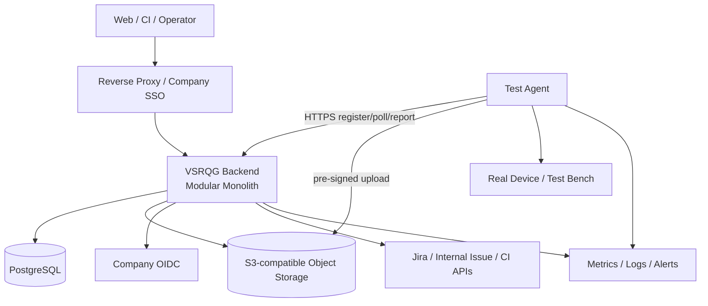
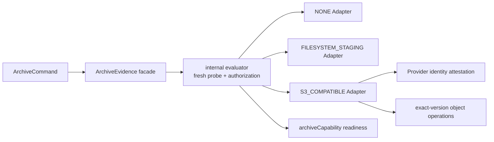

# 13 — MVP Deployment and Operations

## 1. Topology

The Backend contains Release, Manifest, Issue, Traceability, Orchestrator, Evidence Metadata, Quality, Auth/Audit, and background workers. Only Agent is deployed independently because of network and hardware boundaries.

## 2. Recommended Environments

- Development: Docker Compose with Backend + PostgreSQL + MinIO; local authentication only in a development profile.
- Company MVP: company VM or small container platform; start with one Backend instance, managed/dedicated PostgreSQL, company S3/MinIO, reverse proxy, and company OIDC.
- Agent: test-bench host or a controlled environment permitted on the head unit, with independent upgrades and local Evidence spool.

Kubernetes, message queues, Redis, and independent microservices are outside MVP. See [TDR-010](tdr/TDR-010-containerized-vm-deployment.md) for the deployment decision.

## 3. Configuration and Secrets

External configuration supplies environment differences. Secret Manager/platform injects Secrets; only references enter business configuration. Validate required configuration at startup and fail fast when absent, without unsafe defaults. Manifest and Agent Command contain no long-lived Secret.

## 4. Asynchronous Jobs

Synchronous transactions write Outbox. Workers in the same Backend use PostgreSQL `FOR UPDATE SKIP LOCKED`/leases for Adapter sync, Trace verify, Evidence reconcile, Quality Evaluation, and notification hooks. Jobs have idempotency key, attempt, nextRunAt, lease/fencing, and dead-letter state.

DB leases still coordinate multiple instances. Evaluate a Broker only after job volume or isolation needs are quantified. See [TDR-007](tdr/TDR-007-postgresql-job-outbox.md).

## 5. Observability

- Metrics: API latency/error, DB pool, job lag/failure, Adapter sync age, Agent online, Run duration, Evidence upload/verify, Quality evaluation/replay mismatch.
- Logs: structured JSON with requestId/releaseId/runId/commandId; no Secret, presigned URL, or unredacted Payload.
- Traces: MVP may use OpenTelemetry; correlation ID propagates at least across API→job→Agent command.
- Health: liveness means only the process is alive. Readiness validates DB and critical configuration. External-system failures appear separately in dependency health, preventing global restart storms.

Alerts focus on actionable conditions: DB unavailable, backup failure, Agent offline, required Evidence stuck, stale sync, job dead-letter, storage capacity, and replay inconsistency.

## 6. Backup and Recovery

- PostgreSQL: daily full backup + WAL/PITR where supported, encrypted and stored across failure domains.
- Object Storage: versioning/lifecycle policies; critical buckets prohibit anonymous access and uncontrolled overwrite.
- Configuration/Rules/Manifest schema: versioned in Git; deployment record references commit SHA.
- Regularly restore to an isolated environment, reconcile Metadata against object inventory, and replay one historical Quality Result.

Initial Pilot recovery acceptance targets are `RPO ≤ 1 hour` and `RTO ≤ 4 hours`. Recovery rehearsal records measured values. If company infrastructure cannot meet the targets, the Owner and IT must jointly record alternative values, rationale, compensating controls, and risk acceptance before deployment; the system must not claim compliance from unverified configuration.

## 7. Release and Rollback

Release artifacts are versioned and immutable and record application, DB schema, Agent protocol, Rule schema, and Git commit. Steps: backup/check → backward-compatible migration → Backend release → smoke → staged Agent upgrade.

Application rollback must not reverse an irreversible DB schema. Follow Expand/Migrate/Contract. Agent upgrade uses DRAINING, signed package, health validation, and rollback to the previous version.

## 8. Failure Matrix

| Failure | System Behavior | Recovery | Acceptance Focus |
|---|---|---|---|
| Network failure | Idempotent failure/retry, no false success | Bounded backoff | No duplicate entity |
| External system unavailable | Sync FAILED/STALE | Background retry/manual recovery | Snapshot not contaminated |
| Agent disconnect | Lease + RECOVERY_PENDING | Reconnect or new Attempt | Old fencing invalid |
| Device power loss | Attempt ERROR/TIMEOUT | Retry after device preflight | Old Evidence preserved |
| DB failure | Transaction rollback, readiness fails | Failover/restore | No partial Lock/Result |
| Evidence failure | Not AVAILABLE | Spool retransmit/reconcile | Checksum consistent |
| Test timeout | Explicit TIMEOUT | Policy-driven new Attempt | Never becomes PASS |
| Duplicate request | Return original response | No manual action | Unique constraints effective |
| Data inconsistency | Quarantine Release and reject evaluation | Diagnose/fix/new Snapshot | Never degrades to PASS |

## 9. Capacity and Optimization

Before launch, measure one real Release: Artifact/Issue count, Test Result count, Evidence count/size, Agent event rate, and Evaluation time. Calculate capacity from measured growth and retention. Prioritize direct object upload, pagination, indexes, and batch queries; do not add components without evidence.

## 10. Acceptance

- Deploy from an empty environment using documentation and complete smoke.
- State recovers after separate Backend, DB, Object Storage, and Agent restarts.
- Restore database backup and object inventory into an isolated environment and replay a historical Result.
- Monitoring detects critical failures in the failure matrix.
- Deployment artifacts, migrations, and Git commits have one-to-one traceability.

Evidence: deployment record, environment inventory, recovery rehearsal, alert screenshots/events, capacity benchmark, and historical replay report.

## 11. Pilot / Company Implementation Topology

`PILOT` and `COMPANY` reuse the same Modular Monolith, `ArchivePolicy`, evaluator, `ArchiveEvidence` facade, and internal `ArchiveAdapter` Port. A profile governs deployment and acceptance interpretation; it is not a second business system and does not change the V0.1 Core Contract.

The public facade accepts only `ArchiveCommand`. Trusted Spring wiring injects `ArchivePolicy`; only the evaluator derives a Capability Report, and only the same evaluator issues and validates opaque authorization. The Adapter and authorization types remain internal. This is source/module dependency governance, not a security sandbox against hostile same-JVM reflection. V0.2 does not introduce JPMS or another service split to pretend otherwise.

## 12. Configuration and Capability Derivation

The initial configuration is `PILOT` + `NONE`, and all six target-control booleans default to `true`. The booleans require controls such as checksum, encryption, private access, retention, and immutability; they can never directly create an actual `PASS`. Every readiness and archive operation performs a fresh probe and canonicalizes Profile, Provider, boolean fields, path, Endpoint, region, bucket, prefix, owner, retention, and timeouts into a deterministic `policyFingerprint`. A report applies only to its own `checkedAt`.

The `COMPANY` READY invariant is `archive.enabled=true` plus a fresh `EXTERNAL_VERIFIED` Capability. `enabled=false` does not overwrite the actual Provider state, but readiness must be DOWN. `PILOT` may keep the process READY while reporting `UNCONFIGURED` or `LOCAL_PILOT` truthfully. Archive Capability participates only in readiness; liveness and other readiness contributors remain independent.

An Endpoint must be an absolute `http` or `https` URI with a host and no user-info, query, or fragment, and an error must not echo the URI. External probes use `VSRQG_EVIDENCE_ARCHIVE_PROBE_TIMEOUT`; uploads, exact-version downloads, and protection checks use `VSRQG_EVIDENCE_ARCHIVE_OPERATION_TIMEOUT`. Both must be positive, and operation cannot be shorter than probe. Filesystem local I/O does not claim a cancellable timeout; it uses partial cleanup, create-only atomic commit, and retry.

## 13. Pilot Filesystem Deployment Constraints

`FILESYSTEM_STAGING` produces only `LOCAL_PILOT` and a `longTerm=false` receipt; it has no company long-term-retention semantics. The Owner must pre-create an absolute staging root for an exclusive runtime identity. An untrusted process must not share that OS identity, and a network share or uncontrolled mount is prohibited. Cross-process, same-identity TOCTOU is outside the V0.2 threat model and is mitigated through deployment isolation.

A pre-deployment smoke must prove hardlink create-only support on the target filesystem; lack of support fails closed. Path handling verifies real paths, root containment, symlinks, and directory replacement. Separate payload and receipt namespaces, same-directory partial files, SHA-256 recomputation, and create-only commit prevent overwrite. A failure cleans only the current partial and never deletes the source file or a committed object.

## 14. Company S3 Control Model

The native AWS path uses the same default credential chain for S3 and a minimal STS client, and `GetCallerIdentity` proves the runtime identity. A custom S3-compatible endpoint must receive an approved equivalent attestor through trusted wiring; configuration, callers, and environment variables cannot self-report a principal. Raw ARN, account, subject, user ID, and session name exist only in memory to produce an irreversible fingerprint. They do not enter logs, health, receipts, or Evidence.

Every probe re-attests identity and uses policy fingerprint, identity fingerprint, and UTC date to construct daily target/result keys. The create-only winner performs overwrite, delete, and bypass negative tests against the control target's exact version, then persists a `DailyControlRecord` with no self-reference. Only after the result Put succeeds is its exact `resultReference` attached to form a `DailyControlSnapshot`. A loser must read and validate the result by exact version under the same identity. An identity change creates a new winner, two identities cannot share a result, and the daily result expires at the next UTC midnight. Lifecycle can clean objects only after their retain-until, bounding garbage to two small control objects per policy, identity, and date.

`EXTERNAL_VERIFIED` requires all three mutation results to be `DENIED_AS_EXPECTED`, plus verified connection, encryption, private access, versioning, actual `COMPLIANCE` protection on the control target, retention, record digest, and every binding. `ALLOWED`, `INDETERMINATE`, missing identity, network error, timeout, 5xx, an invisible result, or a bucket Object Lock flag alone cannot pass.

## 15. Exact-Version Archive Data Flow

The payload is content-addressed by source SHA-256. Put must return an exact `StoredObjectRef` with bucket, key, `versionId`, digest, and size. Download and Head protection accept only that reference and never fall back to latest. A version shadow, delete marker, concurrent replacement, or digest/size mismatch fails closed.

The receipt records the exact payload reference, current `policyFingerprint`, `capabilityCheckedAt`, `archivedAt`, and actual protection mode. The system produces complete canonical receipt bytes, uses their SHA-256 for content-addressed create-if-absent storage, then applies the same protection check to the receipt's exact version. A receipt has no self-reference; a separate `ArchiveReceiptReference` stores locator, version, and digest. An identical candidate replays the same receipt reference, while new time or Capability facts create a new receipt and preserve history.

Only simultaneous verification of payload, receipt, unexpired identity-bound control, and policy retention returns a long-term receipt. Acceptance Evidence selects and saves one successful independent receipt reference. Configuration, Capability, or a bucket flag alone cannot produce a long-term `PASS`.

## 16. Security, Recovery, and Migration

Secrets enter only from Secret Manager, workload identity, or platform injection. Images, Git, YAML, Manifest, logs, and Evidence must not contain credentials, tokens, internal endpoints, or temporary signed URLs. Provider errors expose only the operation and an allowlisted generic reason.

Any identity, probe, control, upload, download, Head, or receipt failure invalidates current authorization. Recovery retains the source file, control objects, payload, receipt, and exact-version inventory and cleans only the current temporary file. A retry starts with a new probe. Recovery must not reduce retention, delete the only copy, use a bypass identity, reuse controls across identities, fall back to latest, or rewrite failure as success.

Migration from filesystem staging or an old Provider to S3 starts with a version-aware inventory. Copy and reconcile key, version, size, SHA-256, and protection object by object, then verify current identity and receipt before cutover. Do not delete source objects before cutover. Rollback to `PILOT` restores non-production development capability only; it neither changes historical receipts nor automatically changes `M1-OWNER-GATE-001` from `CONDITIONAL`.
