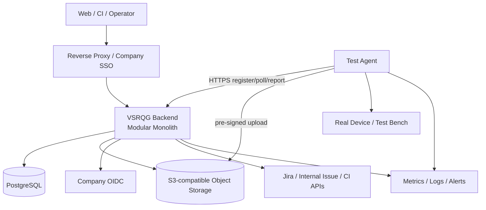

# 13 — MVP Deployment and Operations

## 1. Topology

The Backend contains Release, Manifest, Issue, Traceability, Orchestrator, Evidence Metadata, Quality, Auth/Audit, and background workers. Only Agent is deployed independently because of network and hardware boundaries.

## 2. Recommended Environments

- Development: Docker Compose with Backend + PostgreSQL + MinIO; local authentication only in a development profile.
- Company MVP: company VM or small container platform; start with one Backend instance, managed/dedicated PostgreSQL, company S3/MinIO, reverse proxy, and company OIDC.
- Agent: test-bench host or a controlled environment permitted on the head unit, with independent upgrades and local Evidence spool.

Kubernetes, message queues, Redis, and independent microservices are outside MVP. See [TDR-010](tdr/TDR-010-containerized-vm-deployment.md) for the deployment decision.

## 3. Configuration and Secrets

External configuration supplies environment differences. Secret Manager/platform injects Secrets; only references enter business configuration. Validate required configuration at startup and fail fast when absent, without unsafe defaults. Manifest and Agent Command contain no long-lived Secret.

## 4. Asynchronous Jobs

Synchronous transactions write Outbox. Workers in the same Backend use PostgreSQL `FOR UPDATE SKIP LOCKED`/leases for Adapter sync, Trace verify, Evidence reconcile, Quality Evaluation, and notification hooks. Jobs have idempotency key, attempt, nextRunAt, lease/fencing, and dead-letter state.

DB leases still coordinate multiple instances. Evaluate a Broker only after job volume or isolation needs are quantified. See [TDR-007](tdr/TDR-007-postgresql-job-outbox.md).

## 5. Observability

- Metrics: API latency/error, DB pool, job lag/failure, Adapter sync age, Agent online, Run duration, Evidence upload/verify, Quality evaluation/replay mismatch.
- Logs: structured JSON with requestId/releaseId/runId/commandId; no Secret, presigned URL, or unredacted Payload.
- Traces: MVP may use OpenTelemetry; correlation ID propagates at least across API→job→Agent command.
- Health: liveness means only the process is alive. Readiness validates DB and critical configuration. External-system failures appear separately in dependency health, preventing global restart storms.

Alerts focus on actionable conditions: DB unavailable, backup failure, Agent offline, required Evidence stuck, stale sync, job dead-letter, storage capacity, and replay inconsistency.

## 6. Backup and Recovery

- PostgreSQL: daily full backup + WAL/PITR where supported, encrypted and stored across failure domains.
- Object Storage: versioning/lifecycle policies; critical buckets prohibit anonymous access and uncontrolled overwrite.
- Configuration/Rules/Manifest schema: versioned in Git; deployment record references commit SHA.
- Regularly restore to an isolated environment, reconcile Metadata against object inventory, and replay one historical Quality Result.

The Owner and IT confirm initial recovery objectives. Before confirmation, design acceptance requires a rehearsed recovery with measured RPO/RTO and must not invent promised values.

## 7. Release and Rollback

Release artifacts are versioned and immutable and record application, DB schema, Agent protocol, Rule schema, and Git commit. Steps: backup/check → backward-compatible migration → Backend release → smoke → staged Agent upgrade.

Application rollback must not reverse an irreversible DB schema. Follow Expand/Migrate/Contract. Agent upgrade uses DRAINING, signed package, health validation, and rollback to the previous version.

## 8. Failure Matrix

| Failure | System Behavior | Recovery | Acceptance Focus |
|---|---|---|---|
| Network failure | Idempotent failure/retry, no false success | Bounded backoff | No duplicate entity |
| External system unavailable | Sync FAILED/STALE | Background retry/manual recovery | Snapshot not contaminated |
| Agent disconnect | Lease + RECOVERY_PENDING | Reconnect or new Attempt | Old fencing invalid |
| Device power loss | Attempt ERROR/TIMEOUT | Retry after device preflight | Old Evidence preserved |
| DB failure | Transaction rollback, readiness fails | Failover/restore | No partial Lock/Result |
| Evidence failure | Not AVAILABLE | Spool retransmit/reconcile | Checksum consistent |
| Test timeout | Explicit TIMEOUT | Policy-driven new Attempt | Never becomes PASS |
| Duplicate request | Return original response | No manual action | Unique constraints effective |
| Data inconsistency | Quarantine Release and reject evaluation | Diagnose/fix/new Snapshot | Never degrades to PASS |

## 9. Capacity and Optimization

Before launch, measure one real Release: Artifact/Issue count, Test Result count, Evidence count/size, Agent event rate, and Evaluation time. Calculate capacity from measured growth and retention. Prioritize direct object upload, pagination, indexes, and batch queries; do not add components without evidence.

## 10. Acceptance

- Deploy from an empty environment using documentation and complete smoke.
- State recovers after separate Backend, DB, Object Storage, and Agent restarts.
- Restore database backup and object inventory into an isolated environment and replay a historical Result.
- Monitoring detects critical failures in the failure matrix.
- Deployment artifacts, migrations, and Git commits have one-to-one traceability.

Evidence: deployment record, environment inventory, recovery rehearsal, alert screenshots/events, capacity benchmark, and historical replay report.
