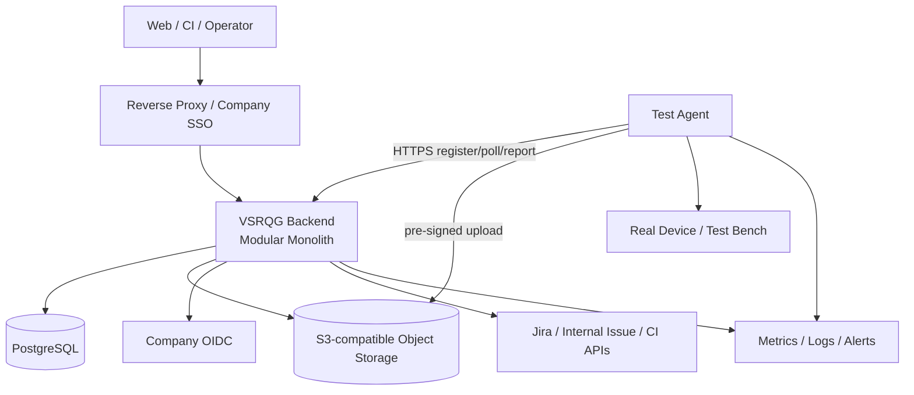
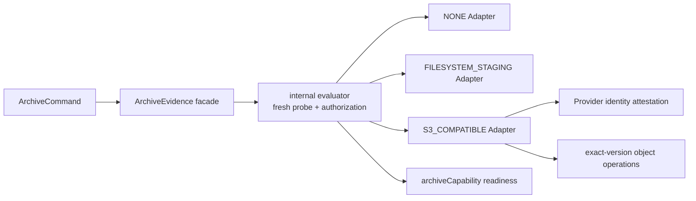

# 13 — MVP 部署与运行设计

## 1. 拓扑

Backend 内含 Release、Manifest、Issue、Traceability、Orchestrator、Evidence Metadata、Quality、Auth/Audit 和 background worker。只有 Agent 因网络/硬件边界独立部署。

## 2. 推荐环境

- 开发：Docker Compose，Backend + PostgreSQL + MinIO；本地认证仅开发 profile。
- 公司 MVP：公司 VM 或小型容器平台，1 个 Backend 实例起步、受管/独立 PostgreSQL、公司 S3/MinIO、反向代理和公司 OIDC。
- Agent：测试台架主机或车机允许的受控环境，独立升级和本地 Evidence spool。

Kubernetes、消息队列、Redis 和独立微服务不进入 MVP。部署决定见 [TDR-010](tdr/TDR-010-containerized-vm-deployment.md)。

## 3. 配置与 Secret

环境差异通过外部配置；Secret 通过 Secret Manager/平台注入，仅以引用进入业务配置。启动时校验必需配置，缺失则失败退出，不使用不安全默认值。Manifest 和 Agent Command 不携带长期 Secret。

## 4. 异步任务

同步事务写 Outbox；同 Backend 的 worker 使用 PostgreSQL `FOR UPDATE SKIP LOCKED`/租约处理 Adapter sync、Trace verify、Evidence reconcile、Quality Evaluation 和 notification hook。任务有幂等键、attempt、nextRunAt、lease/fencing 和 dead-letter 状态。

多实例时仍由 DB 租约协调；只有任务量/隔离需求被量化证明后才评估 Broker。见 [TDR-007](tdr/TDR-007-postgresql-job-outbox.md)。

## 5. 可观测性

- Metrics：API latency/error、DB pool、job lag/failure、Adapter sync age、Agent online、Run duration、Evidence upload/verify、Quality evaluation/replay mismatch。
- Logs：结构化 JSON，requestId/releaseId/runId/commandId；禁止 Secret、预签名 URL和未脱敏 Payload。
- Traces：MVP 可采用 OpenTelemetry，至少跨 API→job→Agent command 传播 correlation ID。
- Health：liveness 只表示进程；readiness 校验 DB 和关键配置，对外系统异常通过 dependency health 单独展示，避免整体重启风暴。

告警聚焦可操作问题：DB 不可用、备份失败、Agent 离线、required Evidence 卡住、sync 过旧、job dead-letter、存储容量、重放不一致。

## 6. 备份与恢复

- PostgreSQL：每日全备 + WAL/PITR（能力允许），加密并跨故障域保存。
- Object Storage：版本化/生命周期策略，关键 bucket 禁止匿名与非受控覆盖。
- 配置/规则/Manifest schema：Git 版本管理；部署记录关联 commit SHA。
- 定期恢复到隔离环境，运行 metadata↔object inventory reconciliation 和一个历史 Quality replay。

Pilot 初始恢复验收目标为 `RPO ≤ 1 hour`、`RTO ≤ 4 hours`。恢复演练必须记录实测值；如果公司基础设施无法满足目标，Owner 与 IT 必须在上线前共同记录替代值、原因、补偿控制和风险接受，系统不得用未验证的配置宣称达标。

## 7. 发布与回滚

发布产物版本化且不可变，记录 application、DB schema、Agent protocol、rule schema 和 Git commit。步骤：备份/检查 → 向后兼容迁移 → Backend 发布 → smoke → Agent 分批升级。

应用回滚不得回退已不可逆 DB schema；遵循 Expand/Migrate/Contract。Agent upgrade 使用 DRAINING、签名包、健康验证和上一版本回滚。

## 8. 异常矩阵

| 异常 | 系统行为 | 恢复 | 验收重点 |
|---|---|---|---|
| 网络异常 | 幂等失败/重试，不假成功 | 有界退避 | 无重复实体 |
| 外部系统不可用 | Sync FAILED/STALE | 后台重试/人工恢复 | 不污染 Snapshot |
| Agent 断连 | 租约 + RECOVERY_PENDING | 重连或新 Attempt | 旧 fencing 失效 |
| Device 断电 | Attempt ERROR/TIMEOUT | 设备预检后重试 | 保留旧 Evidence |
| DB 异常 | 事务回滚、readiness 失败 | failover/restore | 无部分 Lock/Result |
| Evidence 失败 | 非 AVAILABLE | spool 重传/reconcile | checksum 一致 |
| Test 超时 | 明确 TIMEOUT | 策略化新 Attempt | 不转 PASS |
| 重复请求 | 返回原响应 | 无需人工 | 唯一约束生效 |
| 数据不一致 | 隔离 Release，拒绝评估 | 诊断/修复/新 Snapshot | 不降级 PASS |

## 9. 容量与优化

上线前用一个真实 Release 测量：Artifact/Issue 数、Test Result 数、Evidence 数量/大小、Agent event rate、Evaluation 时间。容量按实测增长和保留期计算。优先对象直传、分页、索引和批量查询；没有证据不引入新组件。

## 10. 验收

- 从空环境按文档部署并完成 smoke。
- Backend/DB/Object Storage/Agent 分别重启后状态可恢复。
- 数据库备份和对象清单可恢复到隔离环境，并成功重放历史结果。
- 监控能发现异常矩阵中的关键故障。
- 部署物、迁移和 Git commit 可一一对应。

证据：部署记录、环境清单、恢复演练、告警截图/事件、容量基准和历史重放报告。

## 11. Pilot / Company 实施拓扑

`PILOT` 与 `COMPANY` 复用同一 Modular Monolith、同一 `ArchivePolicy`、同一 evaluator、同一 `ArchiveEvidence` facade 和同一 internal `ArchiveAdapter` Port。Profile 是部署与验收解释，不是第二套业务系统，也不改变 V0.1 Core Contract。

公开 facade 只接受 `ArchiveCommand`。`ArchivePolicy` 由可信 Spring wiring 注入，Capability Report 只能由 evaluator 派生，opaque authorization 只能由同一 evaluator 签发和校验。Adapter 与授权类型保持 internal；这是一项源码/module 依赖治理，不是针对敌对同 JVM reflection 的安全 sandbox。V0.2 不为这一假设引入 JPMS 或额外服务拆分。

## 12. 配置与能力派生

初始配置为 `PILOT` + `NONE`，六个目标控制布尔值默认 `true`。布尔值表示需要 checksum、encryption、private access、retention 和 immutability 等控制，绝不能直接产生实际 `PASS`。每次 readiness 与归档操作都重新 probe，并把 Profile、Provider、布尔项、路径、Endpoint、region、bucket、prefix、owner、retention 和 timeout 规范化为确定性的 `policyFingerprint`；报告只对该次 `checkedAt` 有效。

`COMPANY` 的 READY 不变量是：`archive.enabled=true` 且本次 Capability 为 `EXTERNAL_VERIFIED`。`enabled=false` 不覆盖真实 Provider state，但 readiness 必须为 DOWN。`PILOT` 可在 `UNCONFIGURED` 或 `LOCAL_PILOT` 时保持进程 READY，并如实展示降级状态。archive Capability 仅属于 readiness；liveness 与其他 readiness contributor 独立。

Endpoint 必须是带 host、无 user-info/query/fragment 的绝对 `http`/`https` URI；异常不得回显 URI。外部 probe 使用 `VSRQG_EVIDENCE_ARCHIVE_PROBE_TIMEOUT`，上传、精确版本下载和保护检查使用 `VSRQG_EVIDENCE_ARCHIVE_OPERATION_TIMEOUT`。两者必须为正，operation 不短于 probe。filesystem 本地 I/O 不承诺可取消 timeout，而采用 partial cleanup、create-only 原子提交和重试。

## 13. Pilot filesystem 部署约束

`FILESYSTEM_STAGING` 只产生 `LOCAL_PILOT` 与 `longTerm=false` receipt，不具备公司长期保留语义。staging root 必须由 Owner 预创建为绝对路径，运行身份独占，不允许不可信进程使用同一 OS identity；禁止网络共享和不受控 mount。cross-process same-identity TOCTOU 不在 V0.2 threat model 内，由部署隔离承担补偿控制。

上线前 smoke 必须证明目标文件系统支持 hardlink create-only；不支持时 fail closed。路径使用 real path、root containment、symlink 与目录替换检查；payload 和 receipt 通过独立命名空间、同目录 partial、SHA-256 复算和 create-only commit 防止覆盖。失败只清理本次 partial，不删除源文件或已提交对象。

## 14. Company S3 控制模型

AWS 原生路径使用同一 default credential chain 创建 S3 与最小 STS client，由 `GetCallerIdentity` 证明运行身份。自定义 S3-compatible endpoint 必须通过受信 wiring 提供经批准的等价 attestor；禁止由配置、调用方或环境变量自报主体。原始 ARN、account、subject、user ID 与 session name 只在内存中规范化并产生不可逆 fingerprint，不进入日志、health、receipt 或 Evidence。

每次 probe 都重新 attestation，并以策略指纹、identity fingerprint 与 UTC 日期构造每日 target/result key。create-only winner 对 control target exact version 执行 overwrite、delete 与 bypass 负向测试，再持久化不含自身 reference 的 `DailyControlRecord`；result Put 成功后才附加 exact `resultReference` 形成 `DailyControlSnapshot`。loser 必须以本次相同 identity 按 exact version 读取和校验结果。身份变化产生新 winner，两个身份不能交叉复用；日结果在下一 UTC 零点失效。生命周期只能在各对象 retain-until 后清理，因此每个策略、身份与日期最多保留两个小型 control object。

只有三个 mutation 结果均为 `DENIED_AS_EXPECTED`，且 connection、encryption、private access、versioning、control target 实际 `COMPLIANCE` mode、保留期、record 摘要和所有绑定均通过，才可产生 `EXTERNAL_VERIFIED`。`ALLOWED`、`INDETERMINATE`、无 identity、网络错误、timeout、5xx、未可见结果或 bucket Object Lock flag 单独成立都不能通过。

## 15. 精确版本归档数据流

payload 使用源 SHA-256 内容寻址。Put 必须返回包含 bucket、key、`versionId`、digest 与 size 的 exact `StoredObjectRef`；下载和 Head protection 只能使用该 ref，禁止 fallback 到 latest。version shadow、delete marker、并发替换、摘要或大小不一致均 fail closed。

receipt 记录 payload exact ref、本次 `policyFingerprint`、`capabilityCheckedAt`、`archivedAt` 与实际 protection mode。系统先生成完整 canonical receipt bytes，以其 SHA-256 内容寻址并 create-if-absent，再对 receipt exact version 执行同等保护检查。receipt 不包含自身引用；独立 `ArchiveReceiptReference` 保存 locator、version 与 digest。相同 candidate 重放同一 receipt ref，新的时间或 Capability 事实生成新 receipt 并保留历史对象。

只有 payload、receipt、未过期 identity-bound control 与策略保留期同时验证成功，才返回长期回执。验收 Evidence 选择并保存一次成功的独立 receipt reference；配置、Capability 或 bucket 开关本身不能产生长期 `PASS`。

## 16. 安全、恢复与迁移

Secret 只从 Secret Manager、工作负载身份或平台注入；镜像、Git、YAML、Manifest、日志和 Evidence 不得包含 credential、token、内部 endpoint 或临时签名 URL。Provider 错误对外只保留 operation 与允许的通用原因。

任一 identity、probe、control、上传、下载、Head 或 receipt 失败都会使当前 authorization 失效。恢复保留源文件、control object、payload、receipt 与 exact-version inventory，只清理本次临时文件；修复后从新 probe 开始。不得降低保留期、删除唯一副本、使用旁路身份、跨身份复用 control、fallback 到 latest 或把失败改写为成功。

从 filesystem 或旧 Provider 迁移到 S3 时，先生成 version-aware inventory，逐对象复制并核对 key、version、size、SHA-256 和 protection，验证当前 identity 与回执后再切流。切流前不删除源对象。回滚到 `PILOT` 仅恢复非生产研发能力，不改变历史回执，也不自动改变 `M1-OWNER-GATE-001` 的 `CONDITIONAL` 状态。
