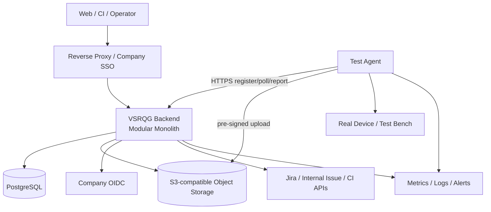

# 13 — MVP Deployment and Operations

## 1. 拓扑

Backend 内含 Release、Manifest、Issue、Traceability、Orchestrator、Evidence Metadata、Quality、Auth/Audit 和 background worker。只有 Agent 因网络/硬件边界独立部署。

## 2. 推荐环境

- 开发：Docker Compose，Backend + PostgreSQL + MinIO；本地认证仅开发 profile。
- 公司 MVP：公司 VM 或小型容器平台，1 个 Backend 实例起步、受管/独立 PostgreSQL、公司 S3/MinIO、反向代理和公司 OIDC。
- Agent：测试台架主机或车机允许的受控环境，独立升级和本地 Evidence spool。

Kubernetes、消息队列、Redis 和独立微服务不进入 MVP。部署决定见 [TDR-010](tdr/TDR-010-containerized-vm-deployment.md)。

## 3. 配置与 Secret

环境差异通过外部配置；Secret 通过 Secret Manager/平台注入，仅以引用进入业务配置。启动时校验必需配置，缺失则失败退出，不使用不安全默认值。Manifest 和 Agent Command 不携带长期 Secret。

## 4. 异步任务

同步事务写 Outbox；同 Backend 的 worker 使用 PostgreSQL `FOR UPDATE SKIP LOCKED`/租约处理 Adapter sync、Trace verify、Evidence reconcile、Quality Evaluation 和 notification hook。任务有幂等键、attempt、nextRunAt、lease/fencing 和 dead-letter 状态。

多实例时仍由 DB 租约协调；只有任务量/隔离需求被量化证明后才评估 Broker。见 [TDR-007](tdr/TDR-007-postgresql-job-outbox.md)。

## 5. 可观测性

- Metrics：API latency/error、DB pool、job lag/failure、Adapter sync age、Agent online、Run duration、Evidence upload/verify、Quality evaluation/replay mismatch。
- Logs：结构化 JSON，requestId/releaseId/runId/commandId；禁止 Secret、预签名 URL和未脱敏 Payload。
- Traces：MVP 可采用 OpenTelemetry，至少跨 API→job→Agent command 传播 correlation ID。
- Health：liveness 只表示进程；readiness 校验 DB 和关键配置，对外系统异常通过 dependency health 单独展示，避免整体重启风暴。

告警聚焦可操作问题：DB 不可用、备份失败、Agent 离线、required Evidence 卡住、sync 过旧、job dead-letter、存储容量、重放不一致。

## 6. 备份与恢复

- PostgreSQL：每日全备 + WAL/PITR（能力允许），加密并跨故障域保存。
- Object Storage：版本化/生命周期策略，关键 bucket 禁止匿名与非受控覆盖。
- 配置/规则/Manifest schema：Git 版本管理；部署记录关联 commit SHA。
- 定期恢复到隔离环境，运行 metadata↔object inventory reconciliation 和一个历史 Quality replay。

初始恢复目标由 Owner 与 IT 确认；在确认前，设计验收要求“可演练并记录实测 RPO/RTO”，不得虚构承诺值。

## 7. 发布与回滚

发布产物版本化且不可变，记录 application、DB schema、Agent protocol、rule schema 和 Git commit。步骤：备份/检查 → 向后兼容迁移 → Backend 发布 → smoke → Agent 分批升级。

应用回滚不得回退已不可逆 DB schema；遵循 Expand/Migrate/Contract。Agent upgrade 使用 DRAINING、签名包、健康验证和上一版本回滚。

## 8. 异常矩阵

| 异常 | 系统行为 | 恢复 | 验收重点 |
|---|---|---|---|
| 网络异常 | 幂等失败/重试，不假成功 | 有界退避 | 无重复实体 |
| 外部系统不可用 | Sync FAILED/STALE | 后台重试/人工恢复 | 不污染 Snapshot |
| Agent 断连 | 租约 + RECOVERY_PENDING | 重连或新 Attempt | 旧 fencing 失效 |
| Device 断电 | Attempt ERROR/TIMEOUT | 设备预检后重试 | 保留旧 Evidence |
| DB 异常 | 事务回滚、readiness 失败 | failover/restore | 无部分 Lock/Result |
| Evidence 失败 | 非 AVAILABLE | spool 重传/reconcile | checksum 一致 |
| Test 超时 | 明确 TIMEOUT | 策略化新 Attempt | 不转 PASS |
| 重复请求 | 返回原响应 | 无需人工 | 唯一约束生效 |
| 数据不一致 | 隔离 Release，拒绝评估 | 诊断/修复/新 Snapshot | 不降级 PASS |

## 9. 容量与优化

上线前用一个真实 Release 测量：Artifact/Issue 数、Test Result 数、Evidence 数量/大小、Agent event rate、Evaluation 时间。容量按实测增长和保留期计算。优先对象直传、分页、索引和批量查询；没有证据不引入新组件。

## 10. 验收

- 从空环境按文档部署并完成 smoke。
- Backend/DB/Object Storage/Agent 分别重启后状态可恢复。
- 数据库备份和对象清单可恢复到隔离环境，并成功重放历史结果。
- 监控能发现异常矩阵中的关键故障。
- 部署物、迁移和 Git commit 可一一对应。

证据：部署记录、环境清单、恢复演练、告警截图/事件、容量基准和历史重放报告。
